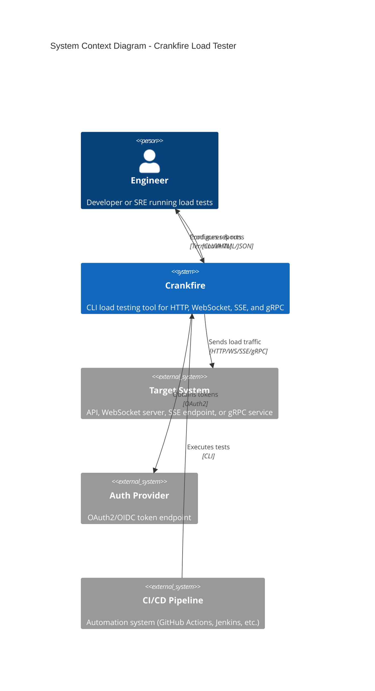
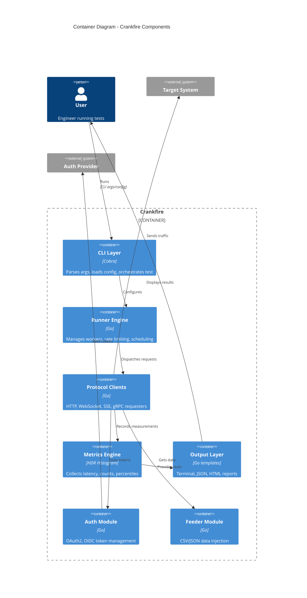
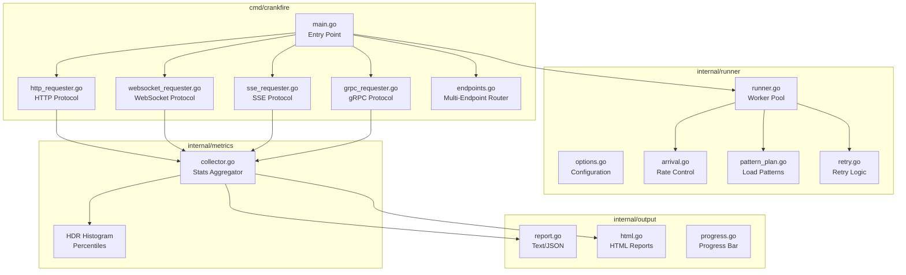
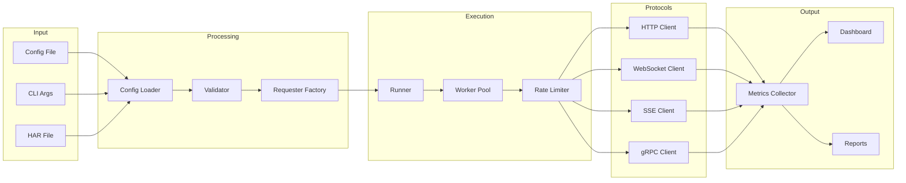
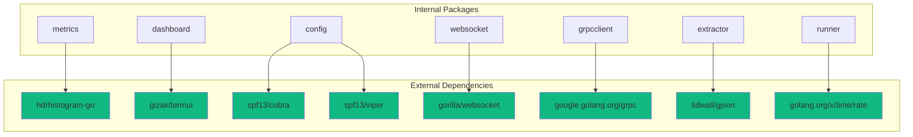

# Architecture Overview

This document describes the system architecture of Crankfire using C4 model diagrams, component relationships, and key design decisions.

## System Context (C4 Level 1)

Crankfire operates as a standalone CLI tool that generates load against target systems while producing metrics and reports.



### External Interactions

| System | Description | Protocol |
|--------|-------------|----------|
| **Target System** | The system under test | HTTP/1.1, HTTP/2, WebSocket, SSE, gRPC |
| **Auth Provider** | OAuth2/OIDC token issuer | HTTPS |
| **CI/CD Pipeline** | Automation orchestrator | Process execution |
| **Terminal** | User's shell | Stdout/stderr |
| **File System** | Config/report files | File I/O |

## Container Architecture (C4 Level 2)

Crankfire is a single-binary application with distinct internal modules.



## Component Architecture (C4 Level 3)

### Core Components



### Request Flow



## Module Breakdown

### 1. Runner Engine (`internal/runner/`)

The Runner is the core execution engine responsible for:

- **Worker Pool Management** - Spawns and coordinates concurrent goroutines
- **Rate Limiting** - Uses `golang.org/x/time/rate` for request pacing
- **Arrival Models** - Implements uniform and Poisson arrival patterns
- **Load Patterns** - Schedules ramp/step/spike patterns over time

**Key Interfaces:**
```go
// Requester executes a single request operation
type Requester interface {
    Do(ctx context.Context) error
}
```

**Design Decisions:**
- **Pull-based scheduling** - Workers pull from a permit channel, avoiding burst overshoot
- **Context propagation** - All operations respect context cancellation for graceful shutdown
- **Immutable configuration** - Options are normalized at creation time

### 2. Metrics Engine (`internal/metrics/`)

High-precision latency tracking using HDR Histogram:

- **Sharded Statistics** - 32 shards reduce contention under high concurrency
- **Protocol-Aware Buckets** - Categorizes failures by HTTP status, WebSocket close codes, gRPC status codes
- **Time-Series History** - Periodic snapshots for dashboard and HTML charts

**Key Types:**
```go
type Collector struct {
    total     *shardedStats           // Global aggregates
    endpoints sync.Map                // Per-endpoint stats
    history   []DataPoint             // Time-series snapshots
}

type EndpointStats struct {
    Total, Successes, Failures int64
    P50Latency, P90Latency, P95Latency, P99Latency time.Duration
    RequestsPerSec float64
    StatusBuckets map[string]map[string]int
}
```

### 3. Protocol Clients

Each protocol has a dedicated client implementation:

| Protocol | Package | Key Features |
|----------|---------|--------------|
| **HTTP** | `internal/httpclient/` | Request building, connection pooling |
| **WebSocket** | `internal/websocket/` | Bidirectional messaging, handshake timing |
| **SSE** | `internal/sse/` | Event stream parsing, connection metrics |
| **gRPC** | `internal/grpcclient/` | Dynamic proto compilation, metadata support |

### 4. Configuration System (`internal/config/`)

Two-phase configuration:

1. **Loading** - CLI flags (Cobra/pflag) merged with YAML/JSON files (Viper)
2. **Validation** - Semantic validation with detailed error messages

**Key Design:**
- Environment variable expansion for secrets (`CRANKFIRE_AUTH_CLIENT_SECRET`)
- Mutually exclusive option detection
- Security warnings for high load settings

### 5. Authentication (`internal/auth/`)

Pluggable authentication providers:

```go
type Provider interface {
    Token(ctx context.Context) (string, error)
    InjectHeader(ctx context.Context, req *http.Request) error
    Close() error
}
```

**Implementations:**
- `OAuth2Provider` - Client credentials and resource owner flows
- `StaticProvider` - Pre-configured bearer tokens

### 6. Data Feeders (`internal/feeder/`)

Round-robin data injection from external sources:

```go
type Feeder interface {
    Next(ctx context.Context) (Record, error)
    Close() error
    Len() int
}

type Record map[string]string
```

**Implementations:**
- CSV feeder with header parsing
- JSON array feeder

### 7. Output System (`internal/output/`)

Multi-format report generation:

| Format | Use Case |
|--------|----------|
| **Terminal** | Human-readable console output |
| **JSON** | Programmatic processing, CI/CD |
| **HTML** | Standalone reports with interactive charts |
| **Dashboard** | Live terminal UI with sparklines |

## Architectural Patterns

### 1. Pipeline Pattern

Request processing follows a linear pipeline with optional middleware:

```
Config → [Auth] → [Feeder] → Requester → [Retry] → [Logging] → Metrics
```

### 2. Strategy Pattern

Protocol handlers are interchangeable implementations of the `Requester` interface:

```go
switch cfg.Protocol {
case ProtocolHTTP:
    requester = newHTTPRequester(...)
case ProtocolWebSocket:
    requester = newWebSocketRequester(...)
// ...
}
```

### 3. Decorator Pattern

Request execution can be wrapped with cross-cutting concerns:

```go
var wrapped Requester = httpReq
if cfg.LogErrors {
    wrapped = runner.WithLogging(wrapped, logger)
}
if cfg.Retries > 0 {
    wrapped = runner.WithRetry(wrapped, policy)
}
```

### 4. Producer-Consumer Pattern

The Runner uses a permit channel for work distribution:

```
Scheduler (1) --[permits]--> Workers (N) --[results]--> Collector (1)
```

## Key Design Decisions

### 1. Single Binary Architecture

**Decision:** Distribute as a statically-linked Go binary with embedded templates.

**Rationale:**
- Zero runtime dependencies simplifies deployment
- Works in restricted environments (containers, CI runners)
- Predictable behavior across platforms

**Trade-offs:**
- Larger binary size (~15MB)
- HTML templates must be regenerated for customization

### 2. HDR Histogram for Latency

**Decision:** Use HdrHistogram-go instead of simple averaging or sampling.

**Rationale:**
- Accurate percentile calculation at any quantile
- Fixed memory footprint regardless of sample count
- Industry-standard algorithm (Gil Tene)

**Trade-offs:**
- Slightly higher memory per endpoint
- Merge operations add complexity

### 3. Sharded Statistics

**Decision:** Use 32 shards with random shard selection for the metrics collector.

**Rationale:**
- Reduces lock contention under high concurrency (100+ workers)
- Random selection provides good distribution
- Merge at read time maintains correctness

**Trade-offs:**
- Additional memory overhead
- Snapshot operations are slower

### 4. Pull-Based Rate Limiting

**Decision:** Workers pull permits from a scheduler rather than push-based dispatch.

**Rationale:**
- Prevents burst overshoot when workers have variable latency
- Natural backpressure when workers are busy
- Simplifies cancellation handling

**Trade-offs:**
- Slight scheduling latency
- Requires careful permit accounting

### 5. Context-Based Cancellation

**Decision:** All operations respect `context.Context` for cancellation.

**Rationale:**
- Graceful shutdown on Ctrl+C
- Timeout propagation to protocol clients
- Consistent error handling patterns

**Trade-offs:**
- Context must be threaded through all layers
- Some third-party libraries require adaptation

## Dependency Diagram



## Security Considerations

### Secret Management

1. **Environment Variables** - Secrets can be injected via `CRANKFIRE_AUTH_*` variables
2. **No CLI Secrets** - Warnings discourage passing secrets via command-line flags
3. **Token Refresh** - OAuth2 tokens are automatically refreshed before expiry

### TLS Configuration

1. **Default: Verify** - TLS certificate verification is enabled by default
2. **Insecure Mode** - Optional skip for development (with prominent warnings)
3. **gRPC TLS** - Configurable per-connection TLS settings

### Rate Limiting Warnings

High concurrency or rate settings trigger security warnings to prevent accidental DoS:

```go
if c.Rate > 1000 {
    warnings = append(warnings, "WARNING: High rate limit configured...")
}
```
