# Workflow Overview

This document describes the core workflows in Crankfire, from test execution to report generation.

## Core Workflows

### 1. Test Execution Workflow

The primary workflow for running a load test from start to finish.

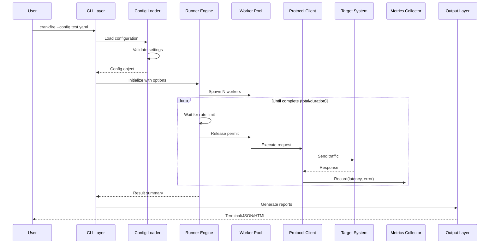
```mermaid
sequenceDiagram
    participant User
    participant CLI as CLI Layer
    participant Config as Config Loader
    participant Runner as Runner Engine
    participant Worker as Worker Pool
    participant Protocol as Protocol Client
    participant Target as Target System
    participant Metrics as Metrics Collector
    participant Output as Output Layer

    User->>CLI: crankfire --config test.yaml
    CLI->>Config: Load configuration
    Config->>Config: Validate settings
    Config-->>CLI: Config object
    
    CLI->>Runner: Initialize with options
    Runner->>Worker: Spawn N workers
    
    loop Until complete (total/duration)
        Runner->>Runner: Wait for rate limit
        Runner->>Worker: Release permit
        Worker->>Protocol: Execute request
        Protocol->>Target: Send traffic
        Target-->>Protocol: Response
        Protocol->>Metrics: Record(latency, error)
    end
    
    Runner-->>CLI: Result summary
    CLI->>Output: Generate reports
    Output-->>User: Terminal/JSON/HTML
```

### 2. Rate-Limited Request Dispatch

The scheduler ensures precise request pacing.

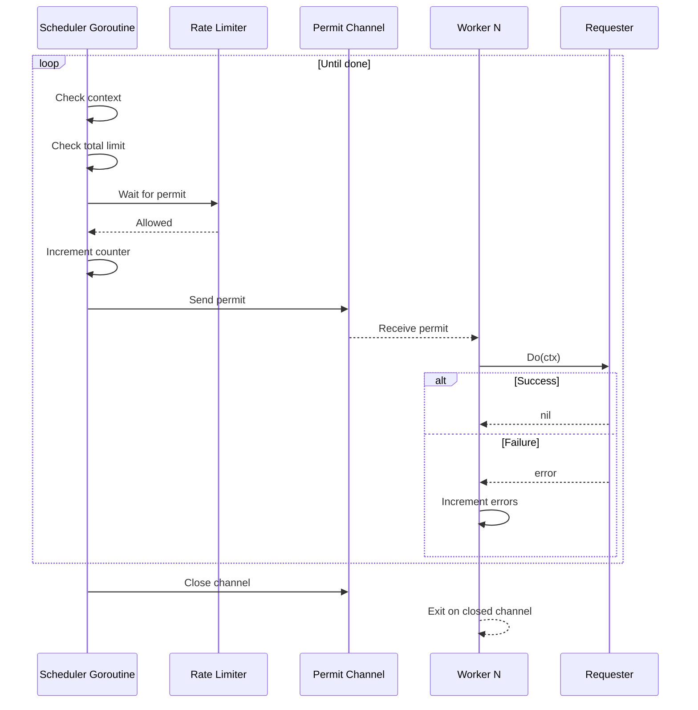
```mermaid
sequenceDiagram
    participant Scheduler as Scheduler Goroutine
    participant Limiter as Rate Limiter
    participant Permits as Permit Channel
    participant Worker as Worker N
    participant Requester as Requester

    loop Until done
        Scheduler->>Scheduler: Check context
        Scheduler->>Scheduler: Check total limit
        Scheduler->>Limiter: Wait for permit
        Limiter-->>Scheduler: Allowed
        Scheduler->>Scheduler: Increment counter
        Scheduler->>Permits: Send permit
        Permits-->>Worker: Receive permit
        Worker->>Requester: Do(ctx)
        alt Success
            Requester-->>Worker: nil
        else Failure
            Requester-->>Worker: error
            Worker->>Worker: Increment errors
        end
    end
    
    Scheduler->>Permits: Close channel
    Worker-->>Worker: Exit on closed channel
```

### 3. HTTP Request with Authentication

Complete flow for an authenticated HTTP request.

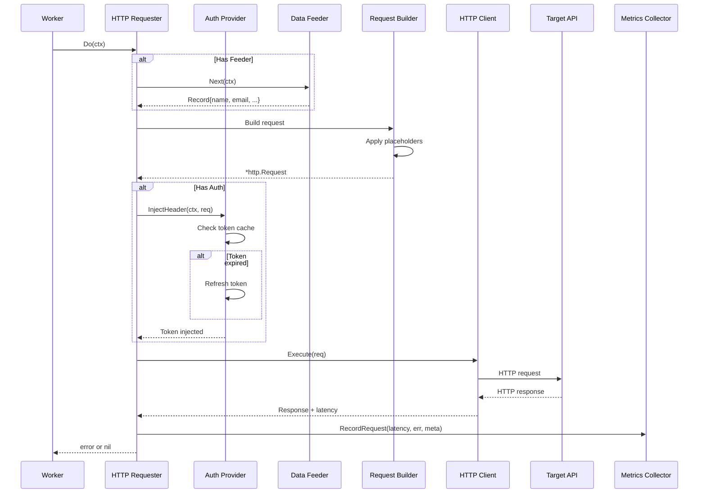
```mermaid
sequenceDiagram
    participant Worker
    participant Requester as HTTP Requester
    participant Auth as Auth Provider
    participant Feeder as Data Feeder
    participant Builder as Request Builder
    participant Client as HTTP Client
    participant Target as Target API
    participant Metrics as Metrics Collector

    Worker->>Requester: Do(ctx)
    
    alt Has Feeder
        Requester->>Feeder: Next(ctx)
        Feeder-->>Requester: Record{name, email, ...}
    end
    
    Requester->>Builder: Build request
    Builder->>Builder: Apply placeholders
    Builder-->>Requester: *http.Request
    
    alt Has Auth
        Requester->>Auth: InjectHeader(ctx, req)
        Auth->>Auth: Check token cache
        alt Token expired
            Auth->>Auth: Refresh token
        end
        Auth-->>Requester: Token injected
    end
    
    Requester->>Client: Execute(req)
    Client->>Target: HTTP request
    Target-->>Client: HTTP response
    Client-->>Requester: Response + latency
    
    Requester->>Metrics: RecordRequest(latency, err, meta)
    Requester-->>Worker: error or nil
```

### 4. Request Chaining with Extraction

Workflow for extracting values from responses and using them in subsequent requests.

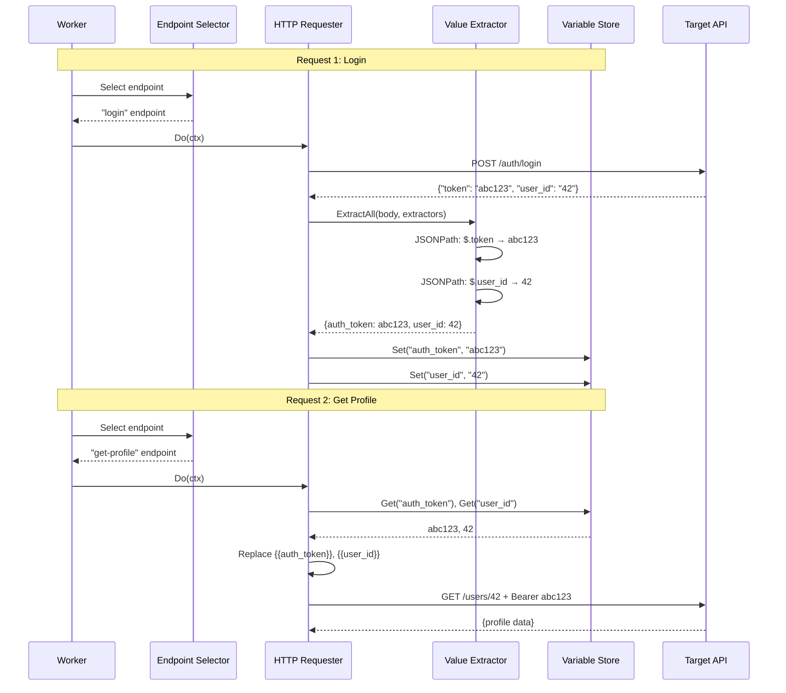
```mermaid
sequenceDiagram
    participant Worker
    participant Selector as Endpoint Selector
    participant Requester as HTTP Requester
    participant Extractor as Value Extractor
    participant Store as Variable Store
    participant Target as Target API

    Note over Worker,Store: Request 1: Login
    Worker->>Selector: Select endpoint
    Selector-->>Worker: "login" endpoint
    Worker->>Requester: Do(ctx)
    Requester->>Target: POST /auth/login
    Target-->>Requester: {"token": "abc123", "user_id": "42"}
    
    Requester->>Extractor: ExtractAll(body, extractors)
    Extractor->>Extractor: JSONPath: $.token → abc123
    Extractor->>Extractor: JSONPath: $.user_id → 42
    Extractor-->>Requester: {auth_token: abc123, user_id: 42}
    
    Requester->>Store: Set("auth_token", "abc123")
    Requester->>Store: Set("user_id", "42")
    
    Note over Worker,Store: Request 2: Get Profile
    Worker->>Selector: Select endpoint
    Selector-->>Worker: "get-profile" endpoint
    Worker->>Requester: Do(ctx)
    Requester->>Store: Get("auth_token"), Get("user_id")
    Store-->>Requester: abc123, 42
    Requester->>Requester: Replace {{auth_token}}, {{user_id}}
    Requester->>Target: GET /users/42 + Bearer abc123
    Target-->>Requester: {profile data}
```

### 5. OAuth2 Token Management

Token acquisition and refresh workflow.

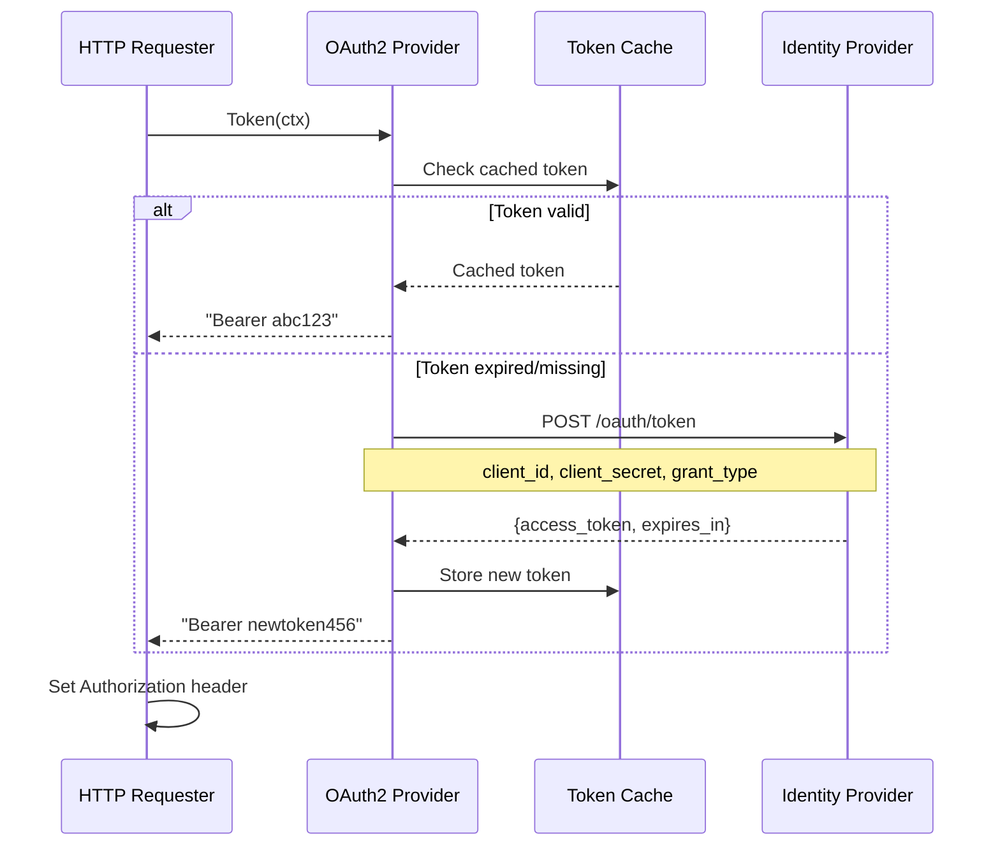
```mermaid
sequenceDiagram
    participant Requester as HTTP Requester
    participant Provider as OAuth2 Provider
    participant Cache as Token Cache
    participant IdP as Identity Provider

    Requester->>Provider: Token(ctx)
    Provider->>Cache: Check cached token
    
    alt Token valid
        Cache-->>Provider: Cached token
        Provider-->>Requester: "Bearer abc123"
    else Token expired/missing
        Provider->>IdP: POST /oauth/token
        Note over Provider,IdP: client_id, client_secret, grant_type
        IdP-->>Provider: {access_token, expires_in}
        Provider->>Cache: Store new token
        Provider-->>Requester: "Bearer newtoken456"
    end
    
    Requester->>Requester: Set Authorization header
```

### 6. WebSocket Load Test Flow

Bidirectional messaging workflow.

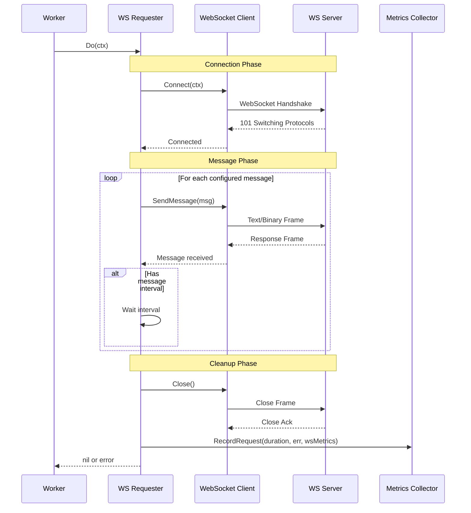
```mermaid
sequenceDiagram
    participant Worker
    participant Requester as WS Requester
    participant WSClient as WebSocket Client
    participant Target as WS Server
    participant Metrics as Metrics Collector

    Worker->>Requester: Do(ctx)
    
    Note over Requester,Target: Connection Phase
    Requester->>WSClient: Connect(ctx)
    WSClient->>Target: WebSocket Handshake
    Target-->>WSClient: 101 Switching Protocols
    WSClient-->>Requester: Connected
    
    Note over Requester,Target: Message Phase
    loop For each configured message
        Requester->>WSClient: SendMessage(msg)
        WSClient->>Target: Text/Binary Frame
        Target-->>WSClient: Response Frame
        WSClient-->>Requester: Message received
        
        alt Has message interval
            Requester->>Requester: Wait interval
        end
    end
    
    Note over Requester,Target: Cleanup Phase
    Requester->>WSClient: Close()
    WSClient->>Target: Close Frame
    Target-->>WSClient: Close Ack
    
    Requester->>Metrics: RecordRequest(duration, err, wsMetrics)
    Requester-->>Worker: nil or error
```

### 7. Load Pattern Execution

Dynamic rate adjustment during test.

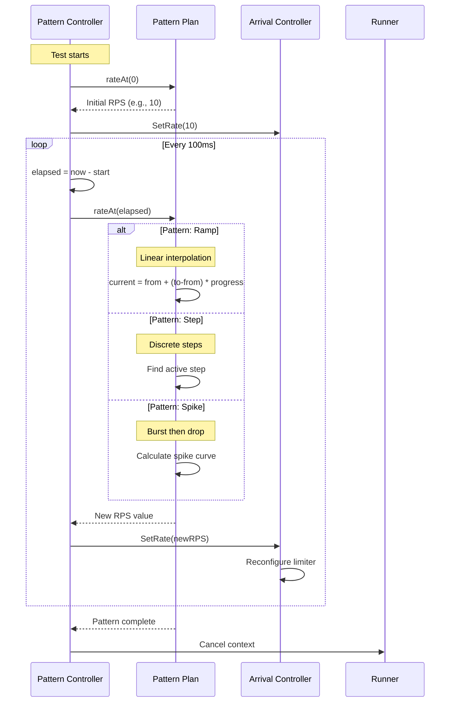
```mermaid
sequenceDiagram
    participant Controller as Pattern Controller
    participant Plan as Pattern Plan
    participant Arrival as Arrival Controller
    participant Runner as Runner

    Note over Controller: Test starts
    Controller->>Plan: rateAt(0)
    Plan-->>Controller: Initial RPS (e.g., 10)
    Controller->>Arrival: SetRate(10)
    
    loop Every 100ms
        Controller->>Controller: elapsed = now - start
        Controller->>Plan: rateAt(elapsed)
        
        alt Pattern: Ramp
            Note over Plan: Linear interpolation
            Plan->>Plan: current = from + (to-from) * progress
        else Pattern: Step
            Note over Plan: Discrete steps
            Plan->>Plan: Find active step
        else Pattern: Spike
            Note over Plan: Burst then drop
            Plan->>Plan: Calculate spike curve
        end
        
        Plan-->>Controller: New RPS value
        Controller->>Arrival: SetRate(newRPS)
        Arrival->>Arrival: Reconfigure limiter
    end
    
    Plan-->>Controller: Pattern complete
    Controller->>Runner: Cancel context
```

### 8. HAR Import Workflow

Converting recorded browser sessions to load tests.

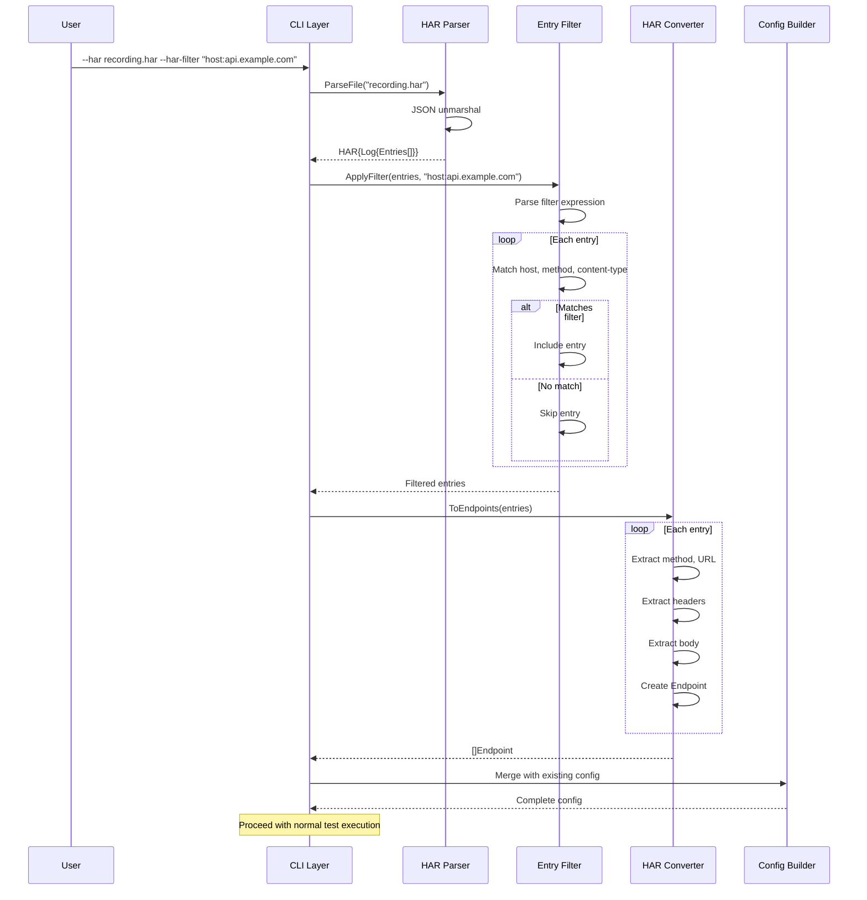
```mermaid
sequenceDiagram
    participant User
    participant CLI as CLI Layer
    participant Parser as HAR Parser
    participant Filter as Entry Filter
    participant Converter as HAR Converter
    participant Config as Config Builder

    User->>CLI: --har recording.har --har-filter "host:api.example.com"
    
    CLI->>Parser: ParseFile("recording.har")
    Parser->>Parser: JSON unmarshal
    Parser-->>CLI: HAR{Log{Entries[]}}
    
    CLI->>Filter: ApplyFilter(entries, "host:api.example.com")
    Filter->>Filter: Parse filter expression
    
    loop Each entry
        Filter->>Filter: Match host, method, content-type
        alt Matches filter
            Filter->>Filter: Include entry
        else No match
            Filter->>Filter: Skip entry
        end
    end
    
    Filter-->>CLI: Filtered entries
    
    CLI->>Converter: ToEndpoints(entries)
    
    loop Each entry
        Converter->>Converter: Extract method, URL
        Converter->>Converter: Extract headers
        Converter->>Converter: Extract body
        Converter->>Converter: Create Endpoint
    end
    
    Converter-->>CLI: []Endpoint
    CLI->>Config: Merge with existing config
    Config-->>CLI: Complete config
    
    Note over CLI: Proceed with normal test execution
```

## Data Flow

### Metrics Aggregation

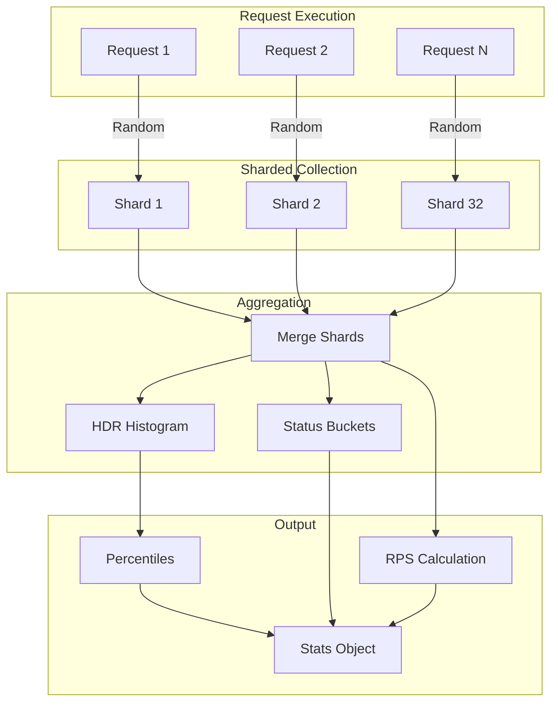
```mermaid
flowchart TB
    subgraph "Request Execution"
        req1[Request 1]
        req2[Request 2]
        reqN[Request N]
    end
    
    subgraph "Sharded Collection"
        shard1[Shard 1]
        shard2[Shard 2]
        shardN[Shard 32]
    end
    
    subgraph "Aggregation"
        merge[Merge Shards]
        hist[HDR Histogram]
        buckets[Status Buckets]
    end
    
    subgraph "Output"
        stats[Stats Object]
        percentiles[Percentiles]
        rps[RPS Calculation]
    end
    
    req1 --> |Random| shard1
    req2 --> |Random| shard2
    reqN --> |Random| shardN
    
    shard1 & shard2 & shardN --> merge
    merge --> hist --> percentiles
    merge --> buckets
    merge --> rps
    
    percentiles & buckets & rps --> stats
```

### Configuration Merging

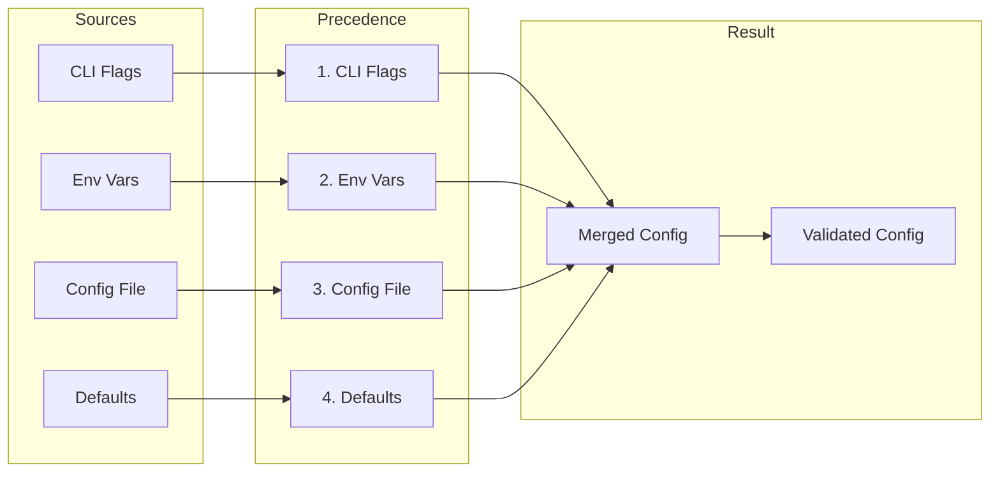
```mermaid
flowchart LR
    subgraph "Sources"
        cli[CLI Flags]
        file[Config File]
        env[Env Vars]
        defaults[Defaults]
    end
    
    subgraph "Precedence"
        direction TB
        p1[1. CLI Flags]
        p2[2. Env Vars]
        p3[3. Config File]
        p4[4. Defaults]
    end
    
    subgraph "Result"
        config[Merged Config]
        validated[Validated Config]
    end
    
    cli --> p1
    env --> p2
    file --> p3
    defaults --> p4
    
    p1 --> config
    p2 --> config
    p3 --> config
    p4 --> config
    
    config --> validated
```

## State Management

### Variable Store Lifecycle

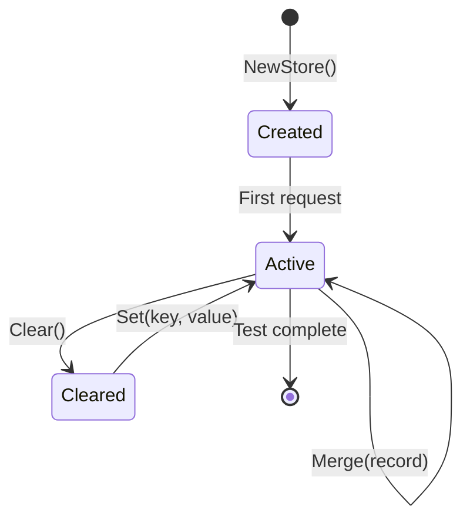
```mermaid
stateDiagram-v2
    [*] --> Created: NewStore()
    Created --> Active: First request
    
    Active --> Active: Set(key, value)
    Active --> Active: Get(key)
    Active --> Active: Merge(record)
    
    Active --> Cleared: Clear()
    Cleared --> Active: Set(key, value)
    
    Active --> [*]: Test complete
```

### Authentication Token States

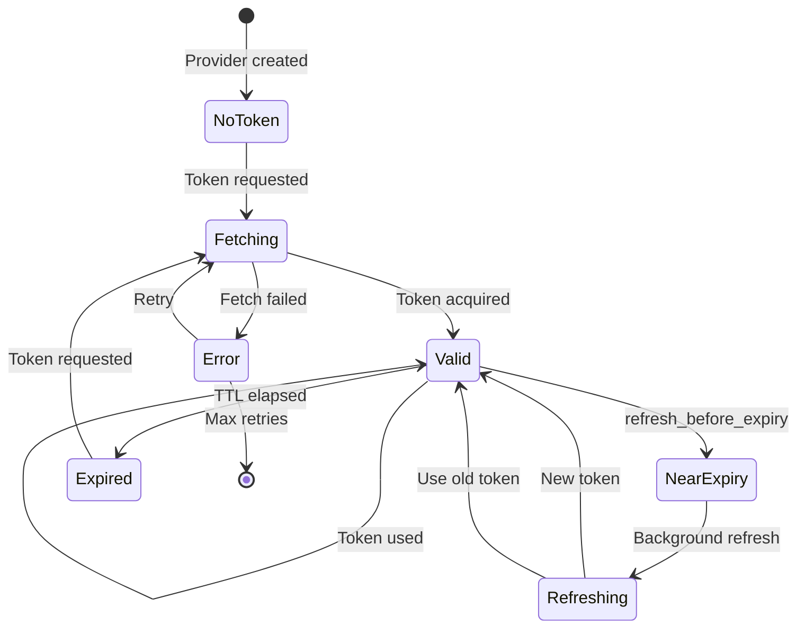
```mermaid
stateDiagram-v2
    [*] --> NoToken: Provider created
    NoToken --> Fetching: Token requested
    
    Fetching --> Valid: Token acquired
    Fetching --> Error: Fetch failed
    
    Valid --> Valid: Token used
    Valid --> NearExpiry: refresh_before_expiry
    Valid --> Expired: TTL elapsed
    
    NearExpiry --> Refreshing: Background refresh
    Refreshing --> Valid: New token
    Refreshing --> Valid: Use old token
    
    Expired --> Fetching: Token requested
    
    Error --> Fetching: Retry
    Error --> [*]: Max retries
```

## Error Handling

### Retry Flow

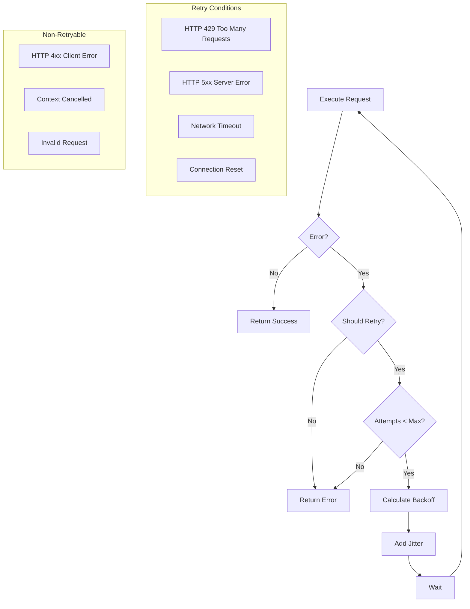
```mermaid
flowchart TB
    start[Execute Request] --> check{Error?}
    
    check -->|No| success[Return Success]
    check -->|Yes| shouldRetry{Should Retry?}
    
    shouldRetry -->|No| fail[Return Error]
    shouldRetry -->|Yes| attempts{Attempts < Max?}
    
    attempts -->|No| fail
    attempts -->|Yes| delay[Calculate Backoff]
    
    delay --> jitter[Add Jitter]
    jitter --> wait[Wait]
    wait --> start
    
    subgraph "Retry Conditions"
        cond1[HTTP 429 Too Many Requests]
        cond2[HTTP 5xx Server Error]
        cond3[Network Timeout]
        cond4[Connection Reset]
    end
    
    subgraph "Non-Retryable"
        nocond1[HTTP 4xx Client Error]
        nocond2[Context Cancelled]
        nocond3[Invalid Request]
    end
```

### Graceful Shutdown

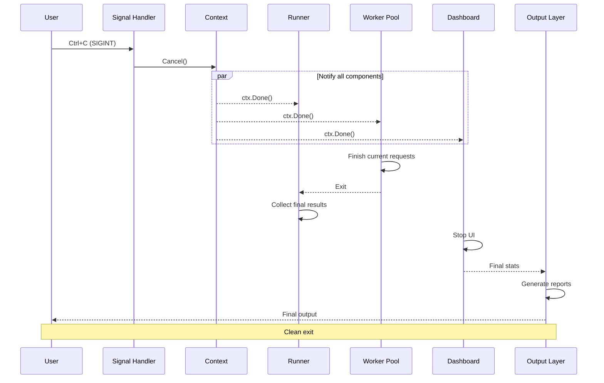
```mermaid
sequenceDiagram
    participant User
    participant Signal as Signal Handler
    participant Context as Context
    participant Runner as Runner
    participant Workers as Worker Pool
    participant Dashboard as Dashboard
    participant Output as Output Layer

    User->>Signal: Ctrl+C (SIGINT)
    Signal->>Context: Cancel()
    
    par Notify all components
        Context-->>Runner: ctx.Done()
        Context-->>Workers: ctx.Done()
        Context-->>Dashboard: ctx.Done()
    end
    
    Workers->>Workers: Finish current requests
    Workers-->>Runner: Exit
    
    Runner->>Runner: Collect final results
    
    Dashboard->>Dashboard: Stop UI
    Dashboard-->>Output: Final stats
    
    Output->>Output: Generate reports
    Output-->>User: Final output
    
    Note over User,Output: Clean exit
```

## Threshold Evaluation

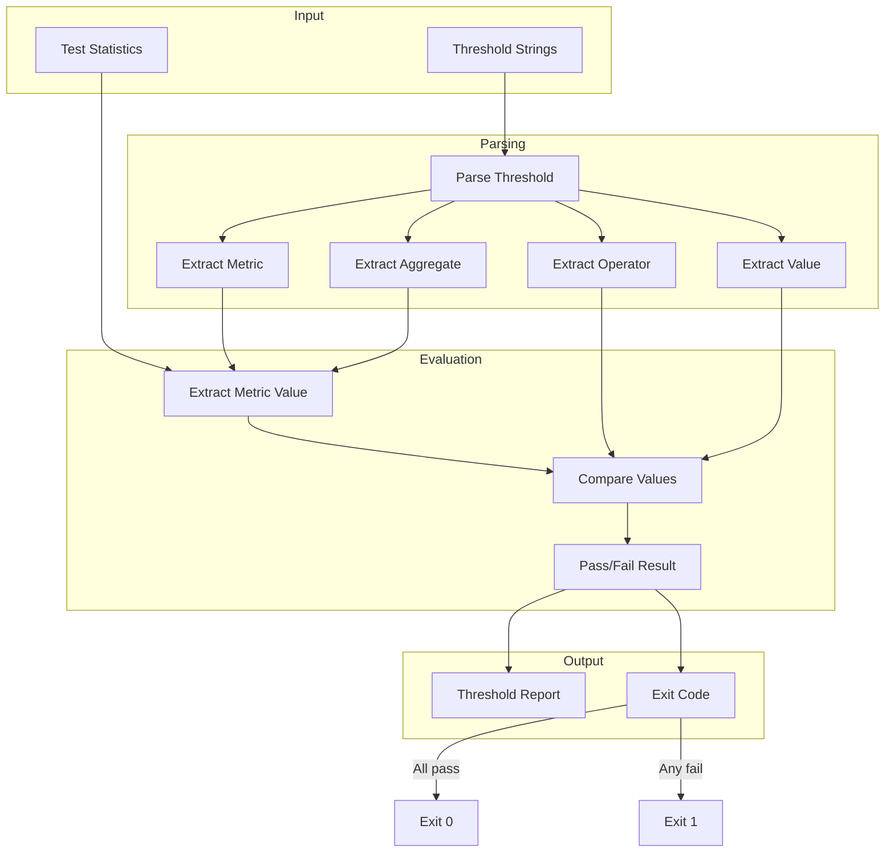
```mermaid
flowchart TB
    subgraph "Input"
        thresholds[Threshold Strings]
        stats[Test Statistics]
    end
    
    subgraph "Parsing"
        parse[Parse Threshold]
        metric[Extract Metric]
        agg[Extract Aggregate]
        op[Extract Operator]
        value[Extract Value]
    end
    
    subgraph "Evaluation"
        extract[Extract Metric Value]
        compare[Compare Values]
        result[Pass/Fail Result]
    end
    
    subgraph "Output"
        report[Threshold Report]
        exitCode[Exit Code]
    end
    
    thresholds --> parse
    parse --> metric & agg & op & value
    
    stats --> extract
    metric & agg --> extract
    
    extract --> compare
    op & value --> compare
    
    compare --> result
    result --> report
    result --> exitCode
    
    exitCode -->|All pass| exit0[Exit 0]
    exitCode -->|Any fail| exit1[Exit 1]
```

## Endpoint Selection

### Weighted Random Selection

```mermaid
flowchart TB
    subgraph "Configuration"
        ep1[Endpoint A<br/>Weight: 8]
        ep2[Endpoint B<br/>Weight: 2]
    end
    
    subgraph "Weight Distribution"
        total[Total Weight: 10]
        range1[0-7 → A (80%)]
        range2[8-9 → B (20%)]
    end
    
    subgraph "Selection"
        rand[Random 0-9]
        select{Value in range?}
        chooseA[Select A]
        chooseB[Select B]
    end
    
    ep1 & ep2 --> total
    total --> range1 & range2
    
    rand --> select
    select -->|0-7| chooseA
    select -->|8-9| chooseB
```

## Dashboard Update Loop

```mermaid
sequenceDiagram
    participant Loop as Event Loop
    participant Collector as Metrics Collector
    participant Widgets as UI Widgets
    participant Terminal as Terminal

    loop Every 500ms
        alt Context cancelled
            Loop->>Loop: Exit
        else UI Event (q, Ctrl+C)
            Loop->>Loop: Trigger shutdown
        else Resize Event
            Loop->>Widgets: Update dimensions
            Loop->>Terminal: Clear & redraw
        else Timer Tick
            Loop->>Collector: Stats(elapsed)
            Collector-->>Loop: Current stats
            
            Loop->>Widgets: Update sparkline
            Loop->>Widgets: Update RPS gauge
            Loop->>Widgets: Update metrics table
            Loop->>Widgets: Update status buckets
            Loop->>Widgets: Update endpoints
            
            Loop->>Terminal: Render grid
        end
    end
```
