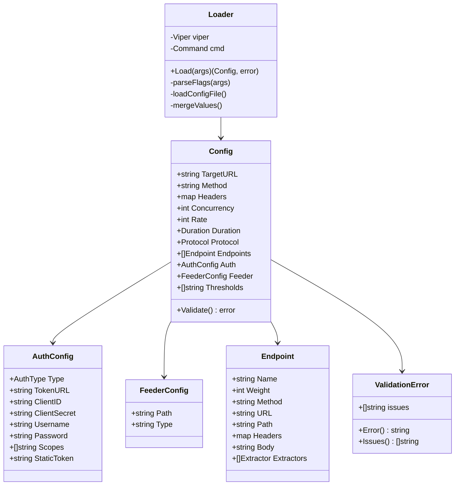
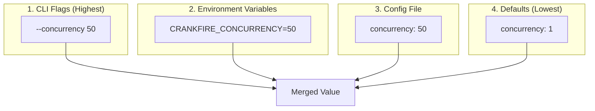
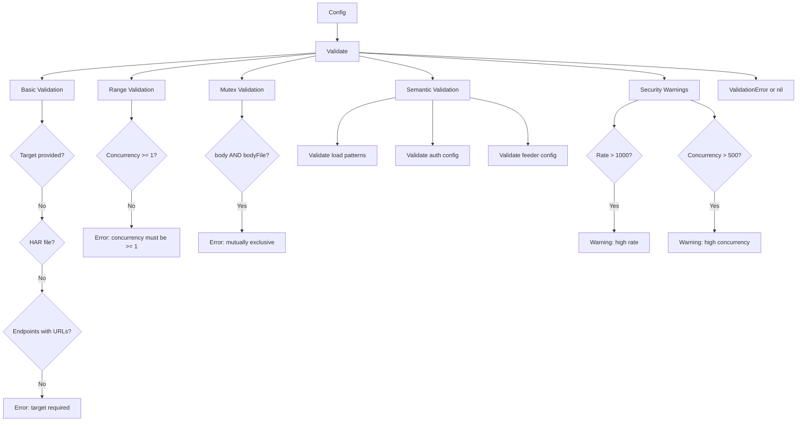

# Deep Dive: Configuration System

The Configuration System handles loading, parsing, validating, and providing configuration to all Crankfire components. It supports CLI flags, environment variables, and YAML/JSON configuration files.

## Overview

The config package (`internal/config/`) provides:

- Multi-source configuration loading (CLI, env, file)
- Precedence-based merging
- Semantic validation with detailed error messages
- Security warnings for high-risk settings
- Type-safe configuration structures

## Architecture



## Key Files

| File | Purpose |
|------|---------|
| `config.go` | Config struct, validation |
| `loader.go` | CLI parsing, file loading |

## Configuration Structure

### Main Config

```go
type Config struct {
    // Target
    TargetURL  string            `mapstructure:"target"`
    Method     string            `mapstructure:"method"`
    Headers    map[string]string `mapstructure:"headers"`
    Body       string            `mapstructure:"body"`
    BodyFile   string            `mapstructure:"body_file"`
    
    // Load settings
    Concurrency  int           `mapstructure:"concurrency"`
    Rate         int           `mapstructure:"rate"`
    Duration     time.Duration `mapstructure:"duration"`
    Total        int           `mapstructure:"total"`
    Timeout      time.Duration `mapstructure:"timeout"`
    Retries      int           `mapstructure:"retries"`
    
    // Output
    JSONOutput bool   `mapstructure:"json_output"`
    Dashboard  bool   `mapstructure:"dashboard"`
    LogErrors  bool   `mapstructure:"log_errors"`
    HTMLOutput string `mapstructure:"html_output"`
    
    // Advanced
    LoadPatterns []LoadPattern   `mapstructure:"load_patterns"`
    Arrival      ArrivalConfig   `mapstructure:"arrival"`
    Endpoints    []Endpoint      `mapstructure:"endpoints"`
    Auth         AuthConfig      `mapstructure:"auth"`
    Feeder       FeederConfig    `mapstructure:"feeder"`
    Protocol     Protocol        `mapstructure:"protocol"`
    WebSocket    WebSocketConfig `mapstructure:"websocket"`
    SSE          SSEConfig       `mapstructure:"sse"`
    GRPC         GRPCConfig      `mapstructure:"grpc"`
    Thresholds   []string        `mapstructure:"thresholds"`
    
    // HAR import
    HARFile   string `mapstructure:"har_file"`
    HARFilter string `mapstructure:"har_filter"`
}
```

### Protocol Types

```go
type Protocol string

const (
    ProtocolHTTP      Protocol = "http"
    ProtocolWebSocket Protocol = "websocket"
    ProtocolSSE       Protocol = "sse"
    ProtocolGRPC      Protocol = "grpc"
)
```

### Load Patterns

```go
type LoadPatternType string

const (
    LoadPatternTypeConstant LoadPatternType = "constant"
    LoadPatternTypeRamp     LoadPatternType = "ramp"
    LoadPatternTypeStep     LoadPatternType = "step"
    LoadPatternTypeSpike    LoadPatternType = "spike"
)

type LoadPattern struct {
    Name     string          `mapstructure:"name"`
    Type     LoadPatternType `mapstructure:"type"`
    FromRPS  int             `mapstructure:"from_rps"`
    ToRPS    int             `mapstructure:"to_rps"`
    Duration time.Duration   `mapstructure:"duration"`
    Steps    []LoadStep      `mapstructure:"steps"`
    RPS      int             `mapstructure:"rps"`
}

type LoadStep struct {
    RPS      int           `mapstructure:"rps"`
    Duration time.Duration `mapstructure:"duration"`
}
```

### Authentication

```go
type AuthType string

const (
    AuthTypeOAuth2ClientCredentials AuthType = "oauth2_client_credentials"
    AuthTypeOAuth2ResourceOwner     AuthType = "oauth2_resource_owner"
    AuthTypeOIDCImplicit            AuthType = "oidc_implicit"
    AuthTypeOIDCAuthCode            AuthType = "oidc_auth_code"
)

type AuthConfig struct {
    Type                AuthType      `mapstructure:"type"`
    TokenURL            string        `mapstructure:"token_url"`
    ClientID            string        `mapstructure:"client_id"`
    ClientSecret        string        `mapstructure:"client_secret"`
    Username            string        `mapstructure:"username"`
    Password            string        `mapstructure:"password"`
    Scopes              []string      `mapstructure:"scopes"`
    StaticToken         string        `mapstructure:"static_token"`
    RefreshBeforeExpiry time.Duration `mapstructure:"refresh_before_expiry"`
}
```

### Endpoints

```go
type Endpoint struct {
    Name       string            `mapstructure:"name"`
    Weight     int               `mapstructure:"weight"`
    Method     string            `mapstructure:"method"`
    URL        string            `mapstructure:"url"`
    Path       string            `mapstructure:"path"`
    Headers    map[string]string `mapstructure:"headers"`
    Body       string            `mapstructure:"body"`
    BodyFile   string            `mapstructure:"body_file"`
    Extractors []Extractor       `mapstructure:"extractors"`
}

type Extractor struct {
    JSONPath string `mapstructure:"jsonpath"`
    Regex    string `mapstructure:"regex"`
    Variable string `mapstructure:"var"`
    OnError  bool   `mapstructure:"on_error"`
}
```

## Configuration Loading

### Loader

The Loader uses Cobra for CLI parsing and Viper for configuration merging:

```go
// internal/config/loader.go

type Loader struct {
    viper *viper.Viper
    cmd   *cobra.Command
}

func NewLoader() *Loader {
    v := viper.New()
    v.SetEnvPrefix("CRANKFIRE")
    v.AutomaticEnv()
    v.SetEnvKeyReplacer(strings.NewReplacer(".", "_", "-", "_"))
    
    return &Loader{viper: v}
}

func (l *Loader) Load(args []string) (*Config, error) {
    // Define CLI flags
    l.cmd = &cobra.Command{
        Use:   "crankfire",
        Short: "High-signal load testing",
        SilenceUsage: true,
    }
    
    l.defineFlags()
    
    // Parse CLI arguments
    if err := l.cmd.ParseFlags(args); err != nil {
        return nil, err
    }
    
    // Check for help flag
    if help, _ := l.cmd.Flags().GetBool("help"); help {
        l.cmd.Help()
        return nil, ErrHelpRequested
    }
    
    // Bind flags to Viper
    l.viper.BindPFlags(l.cmd.Flags())
    
    // Load config file if specified
    if configFile := l.viper.GetString("config"); configFile != "" {
        l.viper.SetConfigFile(configFile)
        if err := l.viper.ReadInConfig(); err != nil {
            return nil, fmt.Errorf("failed to read config: %w", err)
        }
    }
    
    // Unmarshal into Config struct
    var cfg Config
    if err := l.viper.Unmarshal(&cfg); err != nil {
        return nil, fmt.Errorf("failed to parse config: %w", err)
    }
    
    return &cfg, nil
}
```

### Flag Definitions

```go
func (l *Loader) defineFlags() {
    flags := l.cmd.Flags()
    
    // Target settings
    flags.StringP("target", "u", "", "Target URL to test")
    flags.StringP("method", "m", "GET", "HTTP method")
    flags.StringArray("header", nil, "HTTP header (Key=Value, repeatable)")
    flags.String("body", "", "Request body")
    flags.String("body-file", "", "Path to request body file")
    
    // Load settings
    flags.IntP("concurrency", "c", 1, "Number of concurrent workers")
    flags.IntP("rate", "r", 0, "Requests per second (0=unlimited)")
    flags.DurationP("duration", "d", 0, "Test duration")
    flags.IntP("total", "t", 0, "Total requests to send")
    flags.Duration("timeout", 30*time.Second, "Request timeout")
    flags.Int("retries", 0, "Retry attempts")
    
    // Output
    flags.Bool("json-output", false, "Output as JSON")
    flags.Bool("dashboard", false, "Show live dashboard")
    flags.Bool("log-errors", false, "Log failed requests")
    flags.String("html-output", "", "HTML report file")
    
    // Config file
    flags.String("config", "", "Path to config file (YAML/JSON)")
    
    // Protocol
    flags.String("protocol", "http", "Protocol (http, websocket, sse, grpc)")
    
    // Thresholds
    flags.StringArray("threshold", nil, "Performance threshold")
    
    // HAR
    flags.String("har", "", "HAR file path")
    flags.String("har-filter", "", "HAR filter expression")
    
    // ... many more flags
}
```

## Configuration Precedence

Values are merged with the following precedence (highest first):



### Environment Variable Mapping

Viper automatically maps environment variables:

| Config Key | Environment Variable |
|------------|---------------------|
| `target` | `CRANKFIRE_TARGET` |
| `auth.client_secret` | `CRANKFIRE_AUTH_CLIENT_SECRET` |
| `auth.password` | `CRANKFIRE_AUTH_PASSWORD` |
| `auth.static_token` | `CRANKFIRE_AUTH_STATIC_TOKEN` |

## Validation

### Validation Flow



### Validation Implementation

```go
func (c Config) Validate() error {
    var issues []string
    var warnings []string
    
    // Target validation
    if strings.TrimSpace(c.TargetURL) == "" {
        targetSatisfied := false
        
        // HAR file provides URLs
        if strings.TrimSpace(c.HARFile) != "" {
            targetSatisfied = true
        } else if len(c.Endpoints) > 0 {
            // Check if all endpoints have URLs
            allProvideURL := true
            for _, ep := range c.Endpoints {
                if strings.TrimSpace(ep.URL) == "" {
                    allProvideURL = false
                    break
                }
            }
            if allProvideURL {
                targetSatisfied = true
            }
        }
        
        if !targetSatisfied {
            issues = append(issues, "target is required")
        }
    }
    
    // Range validation
    if c.Concurrency < 1 {
        issues = append(issues, "concurrency must be >= 1")
    }
    if c.Rate < 0 {
        issues = append(issues, "rate must be >= 0")
    }
    if c.Total < 0 {
        issues = append(issues, "total must be >= 0")
    }
    
    // Mutually exclusive options
    if c.Body != "" && c.BodyFile != "" {
        issues = append(issues, "body and bodyFile are mutually exclusive")
    }
    if c.Dashboard && c.JSONOutput {
        issues = append(issues, "dashboard and json-output are mutually exclusive")
    }
    
    // Security warnings
    if c.Rate > 1000 {
        warnings = append(warnings, 
            "WARNING: High rate limit configured. Ensure authorization.")
    }
    if c.Concurrency > 500 {
        warnings = append(warnings,
            "WARNING: High concurrency configured. Ensure authorization.")
    }
    
    // Print warnings
    for _, w := range warnings {
        fmt.Fprintln(os.Stderr, w)
    }
    
    // Delegate to sub-validators
    issues = append(issues, validateArrivalConfig(c.Arrival)...)
    issues = append(issues, validateLoadPatterns(c.LoadPatterns)...)
    issues = append(issues, validateEndpoints(c.Endpoints)...)
    issues = append(issues, validateAuthConfig(c.Auth)...)
    issues = append(issues, validateFeederConfig(c.Feeder)...)
    issues = append(issues, validateProtocolConfig(c.Protocol, c.WebSocket, c.SSE, c.GRPC)...)
    
    if len(issues) > 0 {
        return ValidationError{issues: issues}
    }
    return nil
}
```

### Sub-Validators

#### Load Patterns

```go
func validateLoadPatterns(patterns []LoadPattern) []string {
    var issues []string
    
    for idx, pattern := range patterns {
        typeLabel := strings.TrimSpace(string(pattern.Type))
        if typeLabel == "" {
            issues = append(issues, fmt.Sprintf(
                "loadPatterns[%d]: type is required", idx))
            continue
        }
        
        switch LoadPatternType(strings.ToLower(typeLabel)) {
        case LoadPatternTypeConstant:
            if pattern.RPS <= 0 {
                issues = append(issues, fmt.Sprintf(
                    "loadPatterns[%d]: rps must be > 0 for constant", idx))
            }
            if pattern.Duration <= 0 {
                issues = append(issues, fmt.Sprintf(
                    "loadPatterns[%d]: duration must be > 0", idx))
            }
            
        case LoadPatternTypeRamp:
            if pattern.Duration <= 0 {
                issues = append(issues, fmt.Sprintf(
                    "loadPatterns[%d]: duration must be > 0 for ramp", idx))
            }
            
        case LoadPatternTypeStep:
            if len(pattern.Steps) == 0 {
                issues = append(issues, fmt.Sprintf(
                    "loadPatterns[%d]: steps required for step pattern", idx))
            }
            for stepIdx, step := range pattern.Steps {
                if step.RPS < 0 {
                    issues = append(issues, fmt.Sprintf(
                        "loadPatterns[%d].steps[%d]: rps must be >= 0", idx, stepIdx))
                }
                if step.Duration <= 0 {
                    issues = append(issues, fmt.Sprintf(
                        "loadPatterns[%d].steps[%d]: duration must be > 0", idx, stepIdx))
                }
            }
            
        default:
            issues = append(issues, fmt.Sprintf(
                "loadPatterns[%d]: unsupported type %q", idx, pattern.Type))
        }
    }
    
    return issues
}
```

#### Authentication

```go
func validateAuthConfig(auth AuthConfig) []string {
    var issues []string
    
    if auth.Type == "" {
        return nil  // No auth configured
    }
    
    switch auth.Type {
    case AuthTypeOAuth2ClientCredentials:
        if strings.TrimSpace(auth.TokenURL) == "" {
            issues = append(issues, "auth: token_url is required")
        }
        if strings.TrimSpace(auth.ClientID) == "" {
            issues = append(issues, "auth: client_id is required")
        }
        if strings.TrimSpace(auth.ClientSecret) == "" {
            issues = append(issues, "auth: client_secret is required")
        }
        
    case AuthTypeOAuth2ResourceOwner:
        // Same as client credentials, plus username/password
        if strings.TrimSpace(auth.Username) == "" {
            issues = append(issues, "auth: username is required")
        }
        if strings.TrimSpace(auth.Password) == "" {
            issues = append(issues, "auth: password is required")
        }
        
    case AuthTypeOIDCImplicit, AuthTypeOIDCAuthCode:
        if strings.TrimSpace(auth.StaticToken) == "" {
            issues = append(issues, "auth: static_token is required")
        }
        
    default:
        issues = append(issues, fmt.Sprintf("auth: unsupported type %q", auth.Type))
    }
    
    return issues
}
```

#### Extractors

```go
func validateExtractors(endpointIdx int, extractors []Extractor) []string {
    var issues []string
    
    for idx, ext := range extractors {
        hasJSONPath := strings.TrimSpace(ext.JSONPath) != ""
        hasRegex := strings.TrimSpace(ext.Regex) != ""
        
        // Exactly one extraction method required
        if !hasJSONPath && !hasRegex {
            issues = append(issues, fmt.Sprintf(
                "endpoints[%d].extractors[%d]: either jsonpath or regex required",
                endpointIdx, idx))
        }
        if hasJSONPath && hasRegex {
            issues = append(issues, fmt.Sprintf(
                "endpoints[%d].extractors[%d]: specify jsonpath or regex, not both",
                endpointIdx, idx))
        }
        
        // Variable name required and valid
        varName := strings.TrimSpace(ext.Variable)
        if varName == "" {
            issues = append(issues, fmt.Sprintf(
                "endpoints[%d].extractors[%d]: var is required",
                endpointIdx, idx))
        } else if !isValidIdentifier(varName) {
            issues = append(issues, fmt.Sprintf(
                "endpoints[%d].extractors[%d]: var must be a valid identifier",
                endpointIdx, idx))
        }
    }
    
    return issues
}

func isValidIdentifier(s string) bool {
    if len(s) == 0 {
        return false
    }
    // Must start with letter or underscore
    if !unicode.IsLetter(rune(s[0])) && s[0] != '_' {
        return false
    }
    // Rest can contain letters, numbers, underscores
    for _, c := range s[1:] {
        if !unicode.IsLetter(c) && !unicode.IsDigit(c) && c != '_' {
            return false
        }
    }
    return true
}
```

### Validation Error

```go
type ValidationError struct {
    issues []string
}

func (e ValidationError) Error() string {
    if len(e.issues) == 0 {
        return "validation failed"
    }
    return fmt.Sprintf("validation failed: %s", strings.Join(e.issues, "; "))
}

func (e ValidationError) Issues() []string {
    return append([]string(nil), e.issues...)  // Return copy
}
```

## Configuration File Formats

### YAML Example

```yaml
target: https://api.example.com
method: POST
headers:
  Content-Type: application/json
  X-Request-ID: "{{uuid}}"

concurrency: 50
rate: 200
duration: 5m
timeout: 10s
retries: 2

arrival:
  model: poisson

load_patterns:
  - name: warmup
    type: ramp
    from_rps: 10
    to_rps: 200
    duration: 30s
  - name: sustained
    type: constant
    rps: 200
    duration: 4m

endpoints:
  - name: list-products
    weight: 8
    method: GET
    path: /products
    
  - name: create-order
    weight: 2
    method: POST
    path: /orders
    body: '{"product_id": "{{product_id}}", "quantity": {{quantity}}}'
    extractors:
      - jsonpath: $.order_id
        var: order_id

auth:
  type: oauth2_client_credentials
  token_url: https://auth.example.com/oauth/token
  client_id: my-client
  client_secret: "${CRANKFIRE_AUTH_CLIENT_SECRET}"
  scopes:
    - read
    - write

feeder:
  type: csv
  path: ./testdata/orders.csv

thresholds:
  - "http_req_duration:p95 < 500"
  - "http_req_failed:rate < 0.01"
  - "http_requests:rate > 100"

html_output: report.html
dashboard: false
json_output: false
```

### JSON Example

```json
{
  "target": "https://api.example.com",
  "method": "POST",
  "headers": {
    "Content-Type": "application/json"
  },
  "concurrency": 50,
  "rate": 200,
  "duration": "5m",
  "timeout": "10s",
  "endpoints": [
    {
      "name": "list-products",
      "weight": 8,
      "method": "GET",
      "path": "/products"
    }
  ],
  "thresholds": [
    "http_req_duration:p95 < 500"
  ]
}
```

## Security Features

### Secret Management

Secrets can be provided via environment variables:

```bash
export CRANKFIRE_AUTH_CLIENT_SECRET="my-secret"
export CRANKFIRE_AUTH_PASSWORD="my-password"
export CRANKFIRE_AUTH_STATIC_TOKEN="my-token"

crankfire --config test.yaml
```

### Security Warnings

The configuration system emits warnings for potentially dangerous settings:

```go
// High rate/concurrency warnings
if c.Rate > 1000 {
    fmt.Fprintln(os.Stderr, 
        "WARNING: High rate limit configured (%d RPS). "+
        "Ensure you have authorization to test the target system.", c.Rate)
}

// Legacy OAuth2 flow warning
if c.Auth.Type == AuthTypeOAuth2ResourceOwner {
    fmt.Fprintln(os.Stderr,
        "WARNING: oauth2_resource_owner (password grant) is a legacy flow. "+
        "Consider using oauth2_client_credentials or authorization code with PKCE.")
}

// Insecure gRPC warning
if c.Protocol == ProtocolGRPC && c.GRPC.Insecure {
    fmt.Fprintln(os.Stderr,
        "WARNING: gRPC TLS verification is DISABLED. "+
        "This should ONLY be used in development/testing.")
}
```

## Testing

### Unit Tests

```go
func TestConfig_Validate_RequiresTarget(t *testing.T)
func TestConfig_Validate_ConcurrencyRange(t *testing.T)
func TestConfig_Validate_MutuallyExclusive(t *testing.T)
func TestConfig_Validate_AuthConfig(t *testing.T)
func TestConfig_Validate_LoadPatterns(t *testing.T)
func TestConfig_Validate_Extractors(t *testing.T)
```

### Loader Tests

```go
func TestLoader_LoadFromCLI(t *testing.T)
func TestLoader_LoadFromYAML(t *testing.T)
func TestLoader_LoadFromJSON(t *testing.T)
func TestLoader_MergesPrecedence(t *testing.T)
func TestLoader_EnvironmentVariables(t *testing.T)
```

## Dependencies

| Dependency | Purpose |
|------------|---------|
| `github.com/spf13/cobra` | CLI framework |
| `github.com/spf13/viper` | Configuration management |
| `github.com/spf13/pflag` | Flag parsing |
| `go.yaml.in/yaml/v3` | YAML parsing (via Viper) |

## Potential Improvements

1. **Schema Validation** - JSON Schema for config files
2. **Config Generation** - Generate config from recorded sessions
3. **Config Profiles** - Named configuration presets
4. **Remote Config** - Load from URL or cloud storage
5. **Hot Reload** - Update config during test (where safe)
