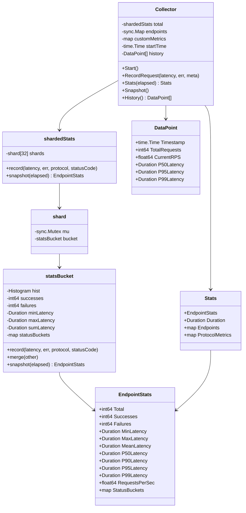

# Deep Dive: Metrics Engine

The Metrics Engine is responsible for collecting, aggregating, and reporting performance data during load tests. It uses HDR Histogram for accurate percentile calculation and a sharded architecture for high-concurrency performance.

## Overview

The metrics package (`internal/metrics/`) provides:

- High-precision latency tracking with HDR Histogram
- Sharded collection to minimize lock contention
- Per-endpoint statistics breakdown
- Protocol-specific error categorization
- Time-series history for dashboards and reports

## Architecture



## Key Files

| File | Purpose |
|------|---------|
| `collector.go` | Main collector, sharding, aggregation |
| `helpers.go` | Status bucket flattening utilities |

## Core Components

### 1. Collector

The main entry point for metrics collection:

```go
type Collector struct {
    total     *shardedStats           // Global aggregates
    endpoints sync.Map                // map[string]*shardedStats
    
    customMu      sync.Mutex
    customMetrics map[string]map[string]interface{}
    
    startTime time.Time
    started   bool
    startMu   sync.Mutex
    
    historyMu    sync.Mutex
    history      []DataPoint
    lastSnapshot snapshotState
}

func NewCollector() *Collector {
    return &Collector{
        total:         newShardedStats(),
        customMetrics: make(map[string]map[string]interface{}),
        history:       []DataPoint{},
    }
}
```

### 2. Recording Requests

Each request is recorded with latency, error state, and optional metadata:

```go
type RequestMetadata struct {
    Endpoint      string                 // Logical endpoint name
    Protocol      string                 // http, websocket, sse, grpc
    StatusCode    string                 // Error code for failures
    CustomMetrics map[string]interface{} // Protocol-specific data
}

func (c *Collector) RecordRequest(latency time.Duration, err error, meta *RequestMetadata) {
    // Record to global stats
    c.total.record(latency, err, protocol, statusCode)
    
    // Record to per-endpoint stats
    if endpoint != "" {
        v, _ := c.endpoints.LoadOrStore(endpoint, newShardedStats())
        v.(*shardedStats).record(latency, err, protocol, statusCode)
    }
    
    // Aggregate custom metrics by protocol
    if len(customMetrics) > 0 {
        c.customMu.Lock()
        for key, value := range customMetrics {
            c.aggregateMetric(protocol, key, value)
        }
        c.customMu.Unlock()
    }
}
```

## Sharded Statistics

### Why Sharding?

Under high concurrency (100+ workers), a single mutex protecting the histogram becomes a bottleneck. Sharding distributes contention across multiple locks.

```go
const numShards = 32

type shardedStats struct {
    shards [numShards]*shard
}

type shard struct {
    mu     sync.Mutex
    bucket *statsBucket
}
```

### Recording with Random Shard Selection

```go
func (s *shardedStats) record(latency time.Duration, err error, protocol, statusCode string) {
    idx := rand.Intn(numShards)  // Random shard selection
    sh := s.shards[idx]
    sh.mu.Lock()
    sh.bucket.record(latency, err, protocol, statusCode)
    sh.mu.Unlock()
}
```

**Why Random Selection?**

- Avoids worker-to-shard affinity that could create hotspots
- Simple and efficient (no atomic counter for round-robin)
- Statistical distribution is good enough for aggregation

### Snapshot with Merge

When statistics are requested, all shards are merged:

```go
func (s *shardedStats) snapshot(elapsed time.Duration) EndpointStats {
    agg := newStatsBucket()
    for _, sh := range s.shards {
        sh.mu.Lock()
        agg.merge(sh.bucket)
        sh.mu.Unlock()
    }
    return agg.snapshot(elapsed)
}
```

## HDR Histogram

### Why HDR Histogram?

Traditional averaging or reservoir sampling has limitations:
- Averages hide outliers
- Fixed-size samples miss rare events
- Simple percentiles are inaccurate under high load

HDR Histogram provides:
- **Constant time** recording and percentile queries
- **Fixed memory** regardless of sample count
- **Accurate percentiles** at any quantile
- **Mergeable** for distributed scenarios

### Configuration

```go
func newStatsBucket() *statsBucket {
    return &statsBucket{
        hist: hdrhistogram.New(
            1,          // Minimum value (1 microsecond)
            60_000_000, // Maximum value (60 seconds in microseconds)
            3,          // Significant figures (0.1% precision)
        ),
    }
}
```

### Recording Latency

```go
func (b *statsBucket) record(latency time.Duration, err error, protocol, statusCode string) {
    if latency > 0 {
        us := latency.Microseconds()
        
        // Clamp to histogram range
        if us < b.hist.LowestTrackableValue() {
            us = b.hist.LowestTrackableValue()
        }
        if us > b.hist.HighestTrackableValue() {
            us = b.hist.HighestTrackableValue()
        }
        
        _ = b.hist.RecordValue(us)  // Error ignored (value is clamped)
    }
    
    // Track min/max/sum for mean calculation
    if b.minLatency == 0 || latency < b.minLatency {
        b.minLatency = latency
    }
    if latency > b.maxLatency {
        b.maxLatency = latency
    }
    b.sumLatency += latency
    
    // Count successes/failures
    if err == nil {
        b.successes++
    } else {
        b.failures++
        if protocol != "" && statusCode != "" {
            b.recordStatus(protocol, statusCode)
        }
    }
}
```

### Extracting Percentiles

```go
func (b *statsBucket) snapshot(elapsed time.Duration) EndpointStats {
    stats := EndpointStats{
        Total:     b.successes + b.failures,
        Successes: b.successes,
        Failures:  b.failures,
    }
    
    if b.hist.TotalCount() > 0 {
        stats.P50Latency = time.Duration(b.hist.ValueAtQuantile(50)) * time.Microsecond
        stats.P90Latency = time.Duration(b.hist.ValueAtQuantile(90)) * time.Microsecond
        stats.P95Latency = time.Duration(b.hist.ValueAtQuantile(95)) * time.Microsecond
        stats.P99Latency = time.Duration(b.hist.ValueAtQuantile(99)) * time.Microsecond
    }
    
    // RPS calculation with minimum elapsed time
    if elapsed >= minElapsedForRPS && stats.Total > 0 {
        stats.RequestsPerSec = float64(stats.Total) / elapsed.Seconds()
    }
    
    return stats
}
```

## Status Buckets

### Error Categorization

Failures are categorized by protocol and status code:

```go
type statusBuckets map[string]map[string]int64
// Example: {"http": {"500": 5, "503": 2}, "grpc": {"UNAVAILABLE": 3}}
```

### Recording Status

```go
func (b *statsBucket) recordStatus(protocol, statusCode string) {
    if b.statusBuckets == nil {
        b.statusBuckets = make(map[string]map[string]int64)
    }
    if b.statusBuckets[protocol] == nil {
        b.statusBuckets[protocol] = make(map[string]int64)
    }
    b.statusBuckets[protocol][statusCode]++
}
```

### Flattening for Display

```go
type StatusRow struct {
    Protocol string
    Code     string
    Count    int
}

func FlattenStatusBuckets(buckets map[string]map[string]int) []StatusRow {
    var rows []StatusRow
    for protocol, codes := range buckets {
        for code, count := range codes {
            rows = append(rows, StatusRow{protocol, code, count})
        }
    }
    // Sort by count descending
    sort.Slice(rows, func(i, j int) bool {
        return rows[i].Count > rows[j].Count
    })
    return rows
}
```

## Time-Series History

### Periodic Snapshots

For dashboards and HTML reports, periodic snapshots capture metrics over time:

```go
func (c *Collector) Snapshot() {
    c.historyMu.Lock()
    defer c.historyMu.Unlock()
    
    now := time.Now()
    summary := c.total.snapshot(time.Since(c.startTime))
    
    // Calculate current RPS from delta
    deltaRequests := summary.Total - c.lastSnapshot.totalRequests
    deltaTime := now.Sub(c.lastSnapshot.timestamp)
    currentRPS := float64(deltaRequests) / deltaTime.Seconds()
    
    dataPoint := DataPoint{
        Timestamp:     now,
        TotalRequests: summary.Total,
        CurrentRPS:    currentRPS,
        P50Latency:    summary.P50Latency,
        P95Latency:    summary.P95Latency,
        P99Latency:    summary.P99Latency,
    }
    
    c.history = append(c.history, dataPoint)
    c.lastSnapshot = snapshotState{now, summary.Total, ...}
}
```

### Snapshot Scheduling

In `main.go`, snapshots are taken every second during tests:

```go
if cfg.HTMLOutput != "" {
    snapshotTicker = time.NewTicker(1 * time.Second)
    go func() {
        for {
            select {
            case <-snapshotTicker.C:
                collector.Snapshot()
            case <-ctx.Done():
                return
            }
        }
    }()
}
```

## Custom Protocol Metrics

### Aggregation

Protocol-specific metrics (bytes sent, messages received, etc.) are aggregated:

```go
func (c *Collector) aggregateMetric(protocol, key string, value interface{}) {
    current := c.customMetrics[protocol][key]
    switch v := value.(type) {
    case int:
        if existing, ok := current.(int); ok {
            c.customMetrics[protocol][key] = existing + v
        } else {
            c.customMetrics[protocol][key] = v
        }
    case int64:
        // Similar handling...
    case float64:
        // Similar handling...
    default:
        // Keep latest value for non-numeric types
        c.customMetrics[protocol][key] = v
    }
}
```

### Example: WebSocket Metrics

```go
meta := &RequestMetadata{
    Protocol: "websocket",
    CustomMetrics: map[string]interface{}{
        "messages_sent":     wsMetrics.MessagesSent,
        "messages_received": wsMetrics.MessagesReceived,
        "bytes_sent":        wsMetrics.BytesSent,
        "bytes_received":    wsMetrics.BytesReceived,
    },
}
collector.RecordRequest(duration, err, meta)
```

## Statistics Output

### Stats Structure

```go
type Stats struct {
    EndpointStats                                    // Embedded global stats
    Duration        time.Duration                    // Test duration
    DurationMs      float64                          // For JSON
    Endpoints       map[string]EndpointStats         // Per-endpoint breakdown
    ProtocolMetrics map[string]map[string]interface{} // Custom metrics
}
```

### JSON-Friendly Fields

For easier JSON consumption, latencies are provided in milliseconds:

```go
type EndpointStats struct {
    // time.Duration fields (internal use)
    P50Latency time.Duration `json:"-"`
    P99Latency time.Duration `json:"-"`
    
    // Millisecond fields (JSON output)
    P50LatencyMs float64 `json:"p50_latency_ms"`
    P99LatencyMs float64 `json:"p99_latency_ms"`
}
```

## Thread Safety

### Locking Strategy

| Component | Lock Type | Scope |
|-----------|-----------|-------|
| Shards | `sync.Mutex` per shard | Per-record |
| Endpoints map | `sync.Map` | Add/lookup |
| Custom metrics | `sync.Mutex` | Per-protocol aggregation |
| History | `sync.Mutex` | Periodic snapshots |
| Start time | `sync.Mutex` | One-time initialization |

### Contention Points

1. **Shard locks** - 32-way sharding distributes contention
2. **Endpoint lookup** - `sync.Map` is optimized for read-heavy workloads
3. **Snapshot merge** - Only during Stats() calls, not per-request

## Performance Characteristics

### Memory Usage

| Component | Size |
|-----------|------|
| HDR Histogram | ~32KB per endpoint |
| Shard overhead | 32 × 32KB = 1MB base |
| History | ~100 bytes per second |

### Time Complexity

| Operation | Complexity |
|-----------|------------|
| RecordRequest | O(1) |
| Snapshot | O(shards + endpoints) |
| ValueAtQuantile | O(log N) buckets |

### Benchmarks

```
BenchmarkCollector_Record-8           5000000    234 ns/op    0 B/op    0 allocs/op
BenchmarkCollector_RecordParallel-8  10000000    156 ns/op    0 B/op    0 allocs/op
BenchmarkCollector_Snapshot-8           50000  28000 ns/op  5600 B/op   12 allocs/op
```

## Integration with Output

### Terminal Report

```go
output.PrintReport(os.Stdout, stats, thresholdResults)
```

### JSON Report

```go
output.PrintJSONReport(os.Stdout, stats, thresholdResults)
```

### HTML Report

```go
history := collector.History()
output.GenerateHTMLReport(file, stats, history, thresholdResults, metadata)
```

## Testing

### Unit Tests

```go
func TestCollector_RecordsLatency(t *testing.T)
func TestCollector_CountsSuccessesAndFailures(t *testing.T)
func TestCollector_TracksEndpoints(t *testing.T)
func TestCollector_CategorizesByStatus(t *testing.T)
func TestCollector_SnapshotHistory(t *testing.T)
```

### Concurrency Tests

```go
func TestCollector_ConcurrentRecords(t *testing.T) {
    c := NewCollector()
    c.Start()
    
    var wg sync.WaitGroup
    for i := 0; i < 1000; i++ {
        wg.Add(1)
        go func() {
            defer wg.Done()
            for j := 0; j < 1000; j++ {
                c.RecordRequest(time.Millisecond, nil, nil)
            }
        }()
    }
    wg.Wait()
    
    stats := c.Stats(time.Minute)
    assert.Equal(t, int64(1000000), stats.Total)
}
```

## Dependencies

| Dependency | Purpose |
|------------|---------|
| `github.com/HdrHistogram/hdrhistogram-go` | Histogram implementation |
| `sync` | Mutex and sync.Map |
| `time` | Duration and timestamps |
| `math/rand` | Shard selection |

## Potential Improvements

1. **Streaming Percentiles** - Calculate percentiles without full merge
2. **Histogram Compression** - Reduce memory for long tests
3. **Distributed Merge** - Combine histograms across nodes
4. **Custom Percentiles** - Allow user-defined quantiles
5. **Histogram Export** - Output raw histogram for external analysis
