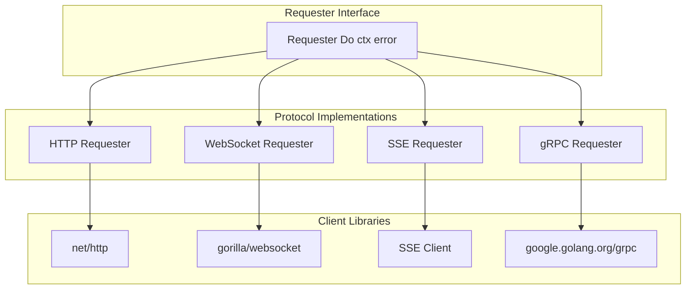
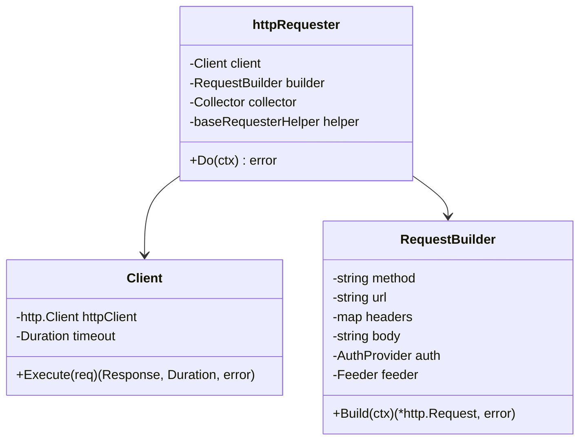
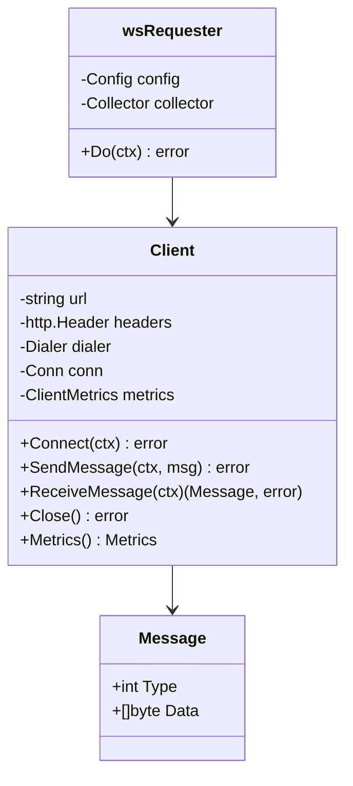
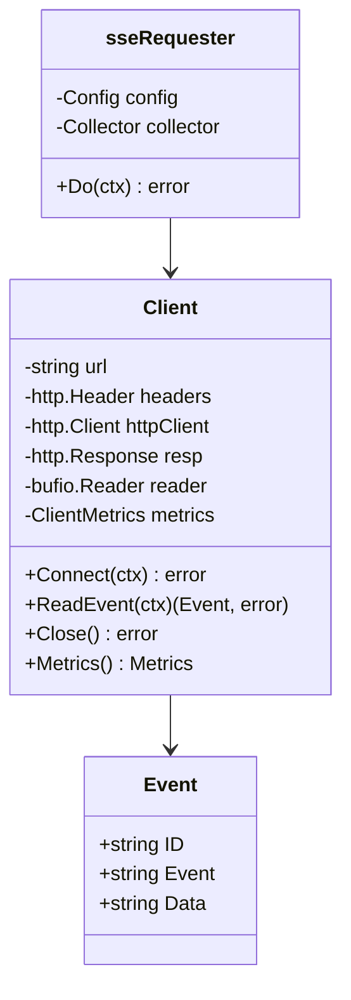
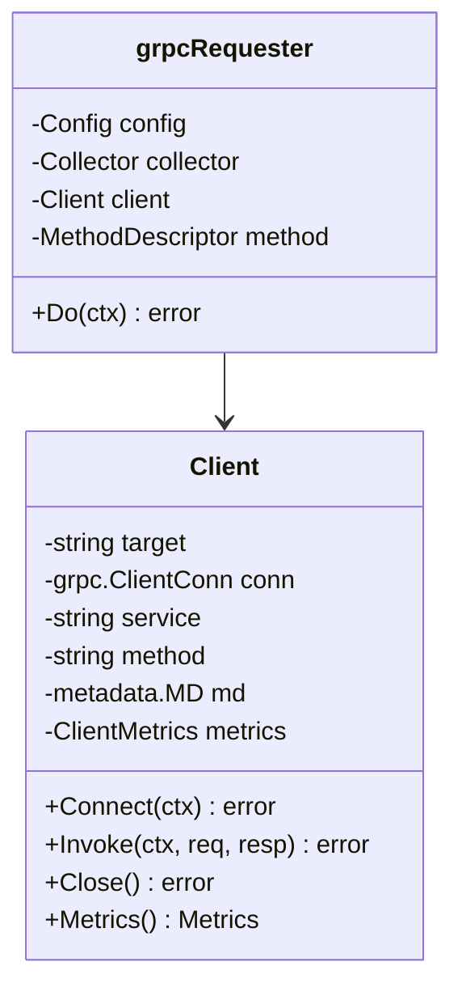

# Deep Dive: Protocol Implementations

Crankfire supports four protocols: HTTP, WebSocket, SSE (Server-Sent Events), and gRPC. Each protocol has a dedicated client implementation that abstracts protocol-specific behavior while conforming to the common `Requester` interface.

## Overview



## HTTP Protocol

### Architecture

The HTTP implementation uses Go's standard `net/http` package with connection pooling:



### Request Execution

```go
// cmd/crankfire/http_requester.go

type httpRequester struct {
    client    *httpclient.Client
    builder   *httpclient.RequestBuilder
    collector *metrics.Collector
    helper    baseRequesterHelper
}

func (r *httpRequester) Do(ctx context.Context) error {
    // Build request with placeholders resolved
    req, err := r.builder.Build(ctx)
    if err != nil {
        return err
    }
    
    // Execute with timing
    resp, latency, err := r.client.Execute(req)
    
    // Record metrics
    meta := &metrics.RequestMetadata{
        Protocol: "http",
    }
    if err != nil {
        var statusErr *httpclient.StatusError
        if errors.As(err, &statusErr) {
            meta.StatusCode = strconv.Itoa(statusErr.Code)
        }
    }
    r.collector.RecordRequest(latency, err, meta)
    
    return err
}
```

### Request Builder

The builder handles placeholder substitution and authentication:

```go
// internal/httpclient/builder.go

type RequestBuilder struct {
    method   string
    url      string
    headers  map[string]string
    body     string
    bodyFile string
    auth     auth.Provider
    feeder   feeder.Feeder
}

func (b *RequestBuilder) Build(ctx context.Context) (*http.Request, error) {
    // Get feeder data if available
    var record feeder.Record
    if b.feeder != nil {
        record, _ = b.feeder.Next(ctx)
    }
    
    // Merge with variables from context
    store := variables.FromContext(ctx)
    if store != nil {
        record = store.Merge(record)
    }
    
    // Resolve placeholders in URL and body
    url := placeholders.Replace(b.url, record)
    body := placeholders.Replace(b.body, record)
    
    // Create request
    req, err := http.NewRequestWithContext(ctx, b.method, url, strings.NewReader(body))
    if err != nil {
        return nil, err
    }
    
    // Apply headers with placeholder resolution
    for key, value := range b.headers {
        req.Header.Set(key, placeholders.Replace(value, record))
    }
    
    // Inject auth token
    if b.auth != nil {
        b.auth.InjectHeader(ctx, req)
    }
    
    return req, nil
}
```

### Connection Pooling

The HTTP client uses Go's built-in connection pool:

```go
// internal/httpclient/client.go

func NewClient(timeout time.Duration) *Client {
    return &Client{
        httpClient: &http.Client{
            Timeout: timeout,
            Transport: &http.Transport{
                MaxIdleConns:        100,
                MaxIdleConnsPerHost: 100,
                IdleConnTimeout:     90 * time.Second,
            },
        },
    }
}

func (c *Client) Execute(req *http.Request) (*Response, time.Duration, error) {
    start := time.Now()
    resp, err := c.httpClient.Do(req)
    latency := time.Since(start)
    
    if err != nil {
        return nil, latency, err
    }
    defer resp.Body.Close()
    
    // Read body for extraction
    body, _ := io.ReadAll(resp.Body)
    
    // Check status code
    if resp.StatusCode >= 400 {
        return nil, latency, &StatusError{Code: resp.StatusCode, Body: body}
    }
    
    return &Response{StatusCode: resp.StatusCode, Body: body}, latency, nil
}
```

## WebSocket Protocol

### Architecture

The WebSocket implementation uses gorilla/websocket for full-duplex messaging:



### Request Execution

Each `Do()` call represents a full WebSocket session:

```go
// cmd/crankfire/websocket_requester.go

func (r *wsRequester) Do(ctx context.Context) error {
    start := time.Now()
    
    // Create client with resolved URL
    url := r.resolveURL(ctx)
    client := websocket.NewClient(websocket.Config{
        URL:              url,
        Headers:          r.headers,
        HandshakeTimeout: r.config.HandshakeTimeout,
    })
    
    // Connect
    if err := client.Connect(ctx); err != nil {
        r.recordMetrics(time.Since(start), err, client.Metrics())
        return err
    }
    defer client.Close()
    
    // Send messages
    for _, msgData := range r.config.Messages {
        msg := websocket.Message{
            Type: websocket.TextMessage,
            Data: []byte(r.resolvePlaceholders(msgData, ctx)),
        }
        
        if err := client.SendMessage(ctx, msg); err != nil {
            r.recordMetrics(time.Since(start), err, client.Metrics())
            return err
        }
        
        // Wait for response
        if _, err := client.ReceiveMessage(ctx); err != nil {
            r.recordMetrics(time.Since(start), err, client.Metrics())
            return err
        }
        
        // Optional interval between messages
        if r.config.MessageInterval > 0 {
            time.Sleep(r.config.MessageInterval)
        }
    }
    
    r.recordMetrics(time.Since(start), nil, client.Metrics())
    return nil
}
```

### WebSocket Client

```go
// internal/websocket/websocket.go

type Client struct {
    url     string
    headers http.Header
    dialer  *websocket.Dialer
    conn    *websocket.Conn
    metrics *clientmetrics.ClientMetrics
    mu      sync.Mutex
}

func (c *Client) Connect(ctx context.Context) error {
    c.mu.Lock()
    defer c.mu.Unlock()
    
    conn, resp, err := c.dialer.DialContext(ctx, c.url, c.headers)
    if err != nil {
        c.metrics.IncrementErrors()
        return fmt.Errorf("dial failed: %w", err)
    }
    
    c.conn = conn
    c.metrics.MarkConnected()
    return nil
}

func (c *Client) SendMessage(ctx context.Context, msg Message) error {
    c.mu.Lock()
    defer c.mu.Unlock()
    
    if err := c.conn.WriteMessage(msg.Type, msg.Data); err != nil {
        c.metrics.IncrementErrors()
        return err
    }
    
    c.metrics.IncrementSent(int64(len(msg.Data)))
    return nil
}

func (c *Client) ReceiveMessage(ctx context.Context) (Message, error) {
    // Set read deadline from context
    if deadline, ok := ctx.Deadline(); ok {
        c.conn.SetReadDeadline(deadline)
    }
    
    msgType, data, err := c.conn.ReadMessage()
    if err != nil {
        c.metrics.IncrementErrors()
        return Message{}, err
    }
    
    c.metrics.IncrementReceived(int64(len(data)))
    return Message{Type: msgType, Data: data}, nil
}
```

### WebSocket Metrics

```go
type Metrics struct {
    ConnectionDuration time.Duration
    MessagesSent       int64
    MessagesReceived   int64
    BytesSent          int64
    BytesReceived      int64
    Errors             int64
}
```

## SSE Protocol

### Architecture

SSE (Server-Sent Events) is a one-way streaming protocol:



### Request Execution

Each `Do()` call connects and reads events:

```go
// cmd/crankfire/sse_requester.go

func (r *sseRequester) Do(ctx context.Context) error {
    start := time.Now()
    
    // Apply timeout context
    if r.config.ReadTimeout > 0 {
        var cancel context.CancelFunc
        ctx, cancel = context.WithTimeout(ctx, r.config.ReadTimeout)
        defer cancel()
    }
    
    // Create client
    client := sse.NewClient(sse.Config{
        URL:     r.resolveURL(ctx),
        Headers: r.headers,
    })
    
    // Connect
    if err := client.Connect(ctx); err != nil {
        r.recordMetrics(time.Since(start), err, client.Metrics())
        return err
    }
    defer client.Close()
    
    // Read events
    eventCount := 0
    for {
        event, err := client.ReadEvent(ctx)
        if err != nil {
            // Connection closed or timeout is expected
            if ctx.Err() != nil {
                break
            }
            r.recordMetrics(time.Since(start), err, client.Metrics())
            return err
        }
        
        eventCount++
        
        // Check max events limit
        if r.config.MaxEvents > 0 && eventCount >= r.config.MaxEvents {
            break
        }
    }
    
    r.recordMetrics(time.Since(start), nil, client.Metrics())
    return nil
}
```

### SSE Client

```go
// internal/sse/sse.go

type Client struct {
    url        string
    headers    http.Header
    httpClient *http.Client
    resp       *http.Response
    reader     *bufio.Reader
    metrics    *clientmetrics.ClientMetrics
    eventsRecv int64
    mu         sync.Mutex
}

func (c *Client) Connect(ctx context.Context) error {
    req, _ := http.NewRequestWithContext(ctx, http.MethodGet, c.url, nil)
    
    // SSE-specific headers
    req.Header.Set("Accept", "text/event-stream")
    req.Header.Set("Cache-Control", "no-cache")
    req.Header.Set("Connection", "keep-alive")
    
    // Copy custom headers
    for key, values := range c.headers {
        for _, value := range values {
            req.Header.Add(key, value)
        }
    }
    
    resp, err := c.httpClient.Do(req)
    if err != nil {
        return err
    }
    
    if resp.StatusCode != http.StatusOK {
        resp.Body.Close()
        return &StatusError{Code: resp.StatusCode}
    }
    
    c.resp = resp
    c.reader = bufio.NewReader(resp.Body)
    c.metrics.MarkConnected()
    return nil
}

func (c *Client) ReadEvent(ctx context.Context) (Event, error) {
    event := Event{}
    var dataLines []string
    
    for {
        // Check context cancellation
        select {
        case <-ctx.Done():
            return Event{}, ctx.Err()
        default:
        }
        
        line, err := c.reader.ReadString('\n')
        if err != nil {
            return Event{}, err
        }
        
        c.metrics.IncrementReceived(int64(len(line)))
        line = strings.TrimRight(line, "\r\n")
        
        // Empty line marks end of event
        if line == "" {
            if len(dataLines) > 0 {
                event.Data = strings.Join(dataLines, "\n")
                c.eventsRecv++
                return event, nil
            }
            continue
        }
        
        // Parse SSE field
        if strings.HasPrefix(line, ":") {
            continue  // Comment
        }
        
        colonIdx := strings.Index(line, ":")
        if colonIdx == -1 {
            continue
        }
        
        field := line[:colonIdx]
        value := strings.TrimPrefix(line[colonIdx+1:], " ")
        
        switch field {
        case "id":
            event.ID = value
        case "event":
            event.Event = value
        case "data":
            dataLines = append(dataLines, value)
        }
    }
}
```

## gRPC Protocol

### Architecture

The gRPC implementation uses dynamic proto compilation:



### Request Execution

```go
// cmd/crankfire/grpc_requester.go

func (r *grpcRequester) Do(ctx context.Context) error {
    start := time.Now()
    
    // Connect if not connected
    if !r.connected {
        if err := r.client.Connect(ctx); err != nil {
            r.recordMetrics(time.Since(start), err, r.client.Metrics())
            return err
        }
        r.connected = true
    }
    
    // Resolve message placeholders
    messageJSON := r.resolvePlaceholders(r.config.Message, ctx)
    
    // Parse JSON to dynamic message
    req := dynamicpb.NewMessage(r.method.Input())
    if err := protojson.Unmarshal([]byte(messageJSON), req); err != nil {
        r.recordMetrics(time.Since(start), err, r.client.Metrics())
        return err
    }
    
    // Create response message
    resp := dynamicpb.NewMessage(r.method.Output())
    
    // Apply timeout
    if r.config.Timeout > 0 {
        var cancel context.CancelFunc
        ctx, cancel = context.WithTimeout(ctx, r.config.Timeout)
        defer cancel()
    }
    
    // Invoke RPC
    if err := r.client.Invoke(ctx, req, resp); err != nil {
        r.recordMetrics(time.Since(start), err, r.client.Metrics())
        return err
    }
    
    r.recordMetrics(time.Since(start), nil, r.client.Metrics())
    return nil
}
```

### gRPC Client

```go
// internal/grpcclient/client.go

type Client struct {
    target   string
    conn     *grpc.ClientConn
    service  string
    method   string
    md       metadata.MD
    useTLS   bool
    insecure bool
    metrics  *clientmetrics.ClientMetrics
    mu       sync.Mutex
}

func (c *Client) Connect(ctx context.Context) error {
    var opts []grpc.DialOption
    
    if c.useTLS {
        if c.insecure {
            // TLS without verification
            creds := credentials.NewTLS(&tls.Config{InsecureSkipVerify: true})
            opts = append(opts, grpc.WithTransportCredentials(creds))
        } else {
            // TLS with system CA
            creds := credentials.NewClientTLSFromCert(nil, "")
            opts = append(opts, grpc.WithTransportCredentials(creds))
        }
    } else {
        opts = append(opts, grpc.WithTransportCredentials(insecure.NewCredentials()))
    }
    
    conn, err := grpc.NewClient(c.target, opts...)
    if err != nil {
        return err
    }
    
    c.conn = conn
    return nil
}

func (c *Client) Invoke(ctx context.Context, req, resp proto.Message) error {
    // Add metadata to context
    if len(c.md) > 0 {
        ctx = metadata.NewOutgoingContext(ctx, c.md)
    }
    
    // Marshal request for metrics
    reqBytes, _ := proto.Marshal(req)
    
    // Build full method path
    fullMethod := fmt.Sprintf("/%s/%s", c.service, c.method)
    
    // Invoke RPC
    err := c.conn.Invoke(ctx, fullMethod, req, resp)
    
    // Record metrics
    c.metrics.IncrementSent(int64(len(reqBytes)))
    if err != nil {
        c.metrics.IncrementErrors()
        return err
    }
    
    respBytes, _ := proto.Marshal(resp)
    c.metrics.IncrementReceived(int64(len(respBytes)))
    return nil
}
```

### Dynamic Proto Compilation

```go
// Using jhump/protoreflect for runtime proto parsing

func compileProto(protoFile string) (*protoreflect.FileDescriptor, error) {
    parser := protoparse.Parser{
        ImportPaths: []string{filepath.Dir(protoFile)},
    }
    
    fds, err := parser.ParseFiles(filepath.Base(protoFile))
    if err != nil {
        return nil, err
    }
    
    return fds[0], nil
}

func findMethod(fd protoreflect.FileDescriptor, service, method string) (protoreflect.MethodDescriptor, error) {
    svc := fd.Services().ByName(protoreflect.Name(service))
    if svc == nil {
        return nil, fmt.Errorf("service %q not found", service)
    }
    
    mtd := svc.Methods().ByName(protoreflect.Name(method))
    if mtd == nil {
        return nil, fmt.Errorf("method %q not found", method)
    }
    
    return mtd, nil
}
```

## Shared Client Metrics

All protocols use a common metrics tracking structure:

```go
// internal/clientmetrics/metrics.go

type ClientMetrics struct {
    connectedAt      time.Time
    messagesSent     int64
    messagesReceived int64
    bytesSent        int64
    bytesReceived    int64
    errors           int64
    mu               sync.Mutex
}

type Snapshot struct {
    ConnectionDuration time.Duration
    MessagesSent       int64
    MessagesReceived   int64
    BytesSent          int64
    BytesReceived      int64
    Errors             int64
}

func (m *ClientMetrics) MarkConnected() {
    m.mu.Lock()
    m.connectedAt = time.Now()
    m.mu.Unlock()
}

func (m *ClientMetrics) IncrementSent(bytes int64) {
    m.mu.Lock()
    m.messagesSent++
    m.bytesSent += bytes
    m.mu.Unlock()
}

func (m *ClientMetrics) IncrementReceived(bytes int64) {
    m.mu.Lock()
    m.messagesReceived++
    m.bytesReceived += bytes
    m.mu.Unlock()
}

func (m *ClientMetrics) Snapshot() Snapshot {
    m.mu.Lock()
    defer m.mu.Unlock()
    
    var duration time.Duration
    if !m.connectedAt.IsZero() {
        duration = time.Since(m.connectedAt)
    }
    
    return Snapshot{
        ConnectionDuration: duration,
        MessagesSent:       m.messagesSent,
        MessagesReceived:   m.messagesReceived,
        BytesSent:          m.bytesSent,
        BytesReceived:      m.bytesReceived,
        Errors:             m.errors,
    }
}
```

## Protocol Comparison

| Feature | HTTP | WebSocket | SSE | gRPC |
|---------|------|-----------|-----|------|
| **Direction** | Request/Response | Bidirectional | Server→Client | Request/Response |
| **Connection** | Per-request (pooled) | Persistent | Persistent | Persistent |
| **Message Format** | Text/Binary | Text/Binary | Text | Protobuf |
| **Retries** | ✅ Supported | ❌ Not supported | ❌ Not supported | ❌ Not supported |
| **Request Chaining** | ✅ JSONPath/Regex | ❌ Not supported | ❌ Not supported | ❌ Not supported |
| **Authentication** | ✅ All types | ✅ All types | ✅ All types | ✅ Metadata |

## Error Categorization

### HTTP Errors

```go
// Status code in status buckets
meta.Protocol = "http"
meta.StatusCode = "500"  // "503", "429", etc.
```

### WebSocket Errors

```go
// Close code in status buckets
meta.Protocol = "websocket"
meta.StatusCode = "1006"  // Abnormal closure
```

### SSE Errors

```go
// HTTP status for connection errors
meta.Protocol = "sse"
meta.StatusCode = "502"  // Bad gateway
```

### gRPC Errors

```go
// gRPC status code
meta.Protocol = "grpc"
meta.StatusCode = "UNAVAILABLE"  // "DEADLINE_EXCEEDED", etc.
```

## Testing

### Protocol-Specific Tests

Each protocol has dedicated integration tests:

```go
// cmd/crankfire/protocol_integration_test.go

func TestHTTP_BasicRequest(t *testing.T)
func TestHTTP_WithAuthentication(t *testing.T)
func TestHTTP_WithFeeder(t *testing.T)
func TestHTTP_RequestChaining(t *testing.T)

func TestWebSocket_BasicSession(t *testing.T)
func TestWebSocket_MultipleMessages(t *testing.T)

func TestSSE_BasicStream(t *testing.T)
func TestSSE_MaxEvents(t *testing.T)

func TestGRPC_BasicCall(t *testing.T)
func TestGRPC_WithMetadata(t *testing.T)
```

### Mock Servers

Test servers are provided in `scripts/testservers/`:

```go
// HTTP mock server
func NewMockHTTPServer() *httptest.Server

// WebSocket mock server
func NewMockWebSocketServer() *httptest.Server

// SSE mock server
func NewMockSSEServer() *httptest.Server

// gRPC mock server
func NewMockGRPCServer() *grpc.Server
```

## Potential Improvements

1. **HTTP/3 Support** - QUIC-based HTTP
2. **Streaming gRPC** - Server/client/bidirectional streaming
3. **WebSocket Subprotocols** - Custom protocol negotiation
4. **SSE Reconnection** - Automatic reconnect with Last-Event-ID
5. **Protocol Plugins** - Dynamic protocol registration
