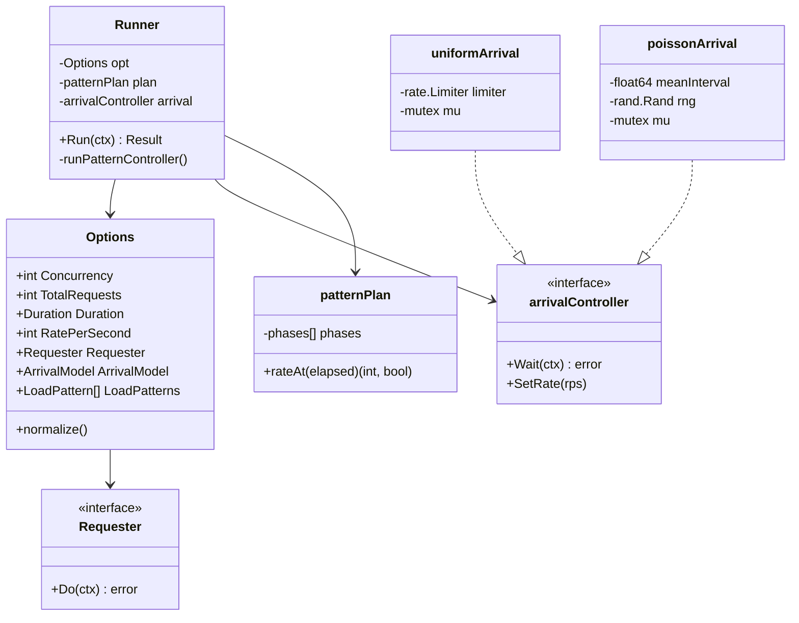
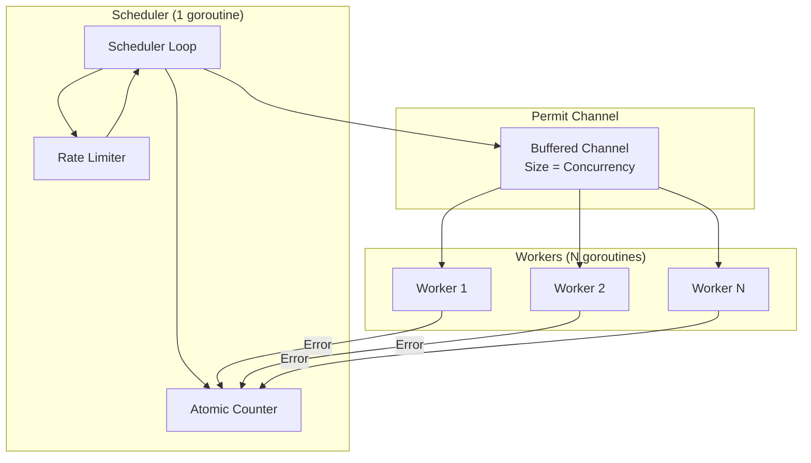

# Deep Dive: Runner Engine

The Runner Engine is the core execution component of Crankfire, responsible for orchestrating concurrent workers, rate limiting, and load pattern scheduling.

## Overview

The runner package (`internal/runner/`) provides a high-performance, configurable execution engine that:

- Manages a pool of concurrent workers
- Implements precise rate limiting with uniform or Poisson arrival models
- Supports dynamic load patterns (ramp, step, spike)
- Handles graceful shutdown via context cancellation
- Provides retry logic with exponential backoff

## Architecture



## Key Files

| File | Purpose |
|------|---------|
| `runner.go` | Core Runner type and Run loop |
| `options.go` | Configuration and Requester interface |
| `arrival.go` | Rate limiting controllers |
| `pattern_plan.go` | Load pattern scheduling |
| `retry.go` | Retry wrapper with backoff |
| `doc.go` | Package documentation |

## Core Components

### 1. Runner

The `Runner` struct coordinates test execution:

```go
type Runner struct {
    opt     Options          // Normalized configuration
    plan    *patternPlan     // Compiled load pattern schedule
    arrival arrivalController // Rate limiter
}

func New(opt Options) *Runner {
    opt.normalize()  // Apply defaults
    plan := compilePatternPlan(opt.LoadPatterns)
    arrival := newArrivalController(opt, plan)
    return &Runner{opt: opt, plan: plan, arrival: arrival}
}
```

### 2. Execution Loop

The `Run` method implements a producer-consumer pattern:

```go
func (r *Runner) Run(ctx context.Context) Result {
    // Setup
    ctx, cancel := context.WithCancel(ctx)
    defer cancel()
    
    if r.opt.Duration > 0 {
        ctx, _ = context.WithTimeout(ctx, r.opt.Duration)
    }
    
    // Permit channel for work distribution
    permits := make(chan struct{}, r.opt.Concurrency)
    
    // Scheduler goroutine (producer)
    go func() {
        defer close(permits)
        for {
            // Check termination conditions
            if ctx.Err() != nil { return }
            if r.opt.TotalRequests > 0 && total >= r.opt.TotalRequests { return }
            
            // Wait for rate limit
            if r.arrival != nil {
                r.arrival.Wait(ctx)
            }
            
            // Increment counter before releasing permit
            atomic.AddInt64(&total, 1)
            
            // Release permit to workers
            select {
            case permits <- struct{}{}:
            case <-ctx.Done():
                return
            }
        }
    }()
    
    // Worker goroutines (consumers)
    var wg sync.WaitGroup
    for i := 0; i < r.opt.Concurrency; i++ {
        wg.Add(1)
        go func() {
            defer wg.Done()
            for range permits {
                if err := r.opt.Requester.Do(ctx); err != nil {
                    atomic.AddInt64(&errs, 1)
                }
            }
        }()
    }
    
    wg.Wait()
    return Result{Total: total, Errors: errs, Duration: elapsed}
}
```

**Key Design Decisions:**

1. **Pre-increment counter** - Counter is incremented before releasing permit to prevent over-execution
2. **Centralized scheduling** - Single scheduler goroutine serializes rate limiting
3. **Non-blocking permits** - Workers pull permits, avoiding push-based backpressure issues
4. **Context-aware** - All operations check for context cancellation

### 3. Requester Interface

The `Requester` interface abstracts request execution:

```go
type Requester interface {
    Do(ctx context.Context) error
}
```

This simple interface allows:
- Protocol-specific implementations (HTTP, WebSocket, SSE, gRPC)
- Decorator wrapping (retry, logging)
- Easy testing with mock implementations

## Arrival Models

### Uniform Arrival

Evenly spaced requests using `golang.org/x/time/rate`:

```go
type uniformArrival struct {
    mu      sync.Mutex
    limiter *rate.Limiter
}

func (u *uniformArrival) Wait(ctx context.Context) error {
    u.mu.Lock()
    limiter := u.limiter
    u.mu.Unlock()
    return limiter.Wait(ctx)
}

func (u *uniformArrival) SetRate(rps int) {
    u.mu.Lock()
    defer u.mu.Unlock()
    if rps <= 0 {
        u.limiter = rate.NewLimiter(rate.Inf, 0)
    } else {
        u.limiter.SetLimit(rate.Limit(rps))
    }
}
```

### Poisson Arrival

Realistic random arrival times following exponential distribution:

```go
type poissonArrival struct {
    mu           sync.Mutex
    meanInterval time.Duration
    rng          *rand.Rand
}

func (p *poissonArrival) Wait(ctx context.Context) error {
    p.mu.Lock()
    if p.meanInterval <= 0 {
        p.mu.Unlock()
        return nil  // Unlimited rate
    }
    
    // Exponential distribution: -ln(U) * mean
    interval := time.Duration(
        -math.Log(p.rng.Float64()) * float64(p.meanInterval),
    )
    p.mu.Unlock()
    
    timer := time.NewTimer(interval)
    defer timer.Stop()
    
    select {
    case <-timer.C:
        return nil
    case <-ctx.Done():
        return ctx.Err()
    }
}
```

**Why Poisson?**

Real-world traffic doesn't arrive at perfectly uniform intervals. Poisson arrival models the random nature of user requests, providing more realistic load testing.

## Load Patterns

### Pattern Types

```go
type LoadPatternType string

const (
    LoadPatternTypeRamp  LoadPatternType = "ramp"   // Linear RPS change
    LoadPatternTypeStep  LoadPatternType = "step"   // Discrete RPS stages
    LoadPatternTypeSpike LoadPatternType = "spike"  // Burst then drop
)
```

### Pattern Plan Compilation

Patterns are compiled into a `patternPlan` for efficient runtime lookup:

```go
type phase struct {
    start, end time.Duration
    startRPS   int
    endRPS     int
    isRamp     bool
}

type patternPlan struct {
    phases   []phase
    totalDur time.Duration
}

func (p *patternPlan) rateAt(elapsed time.Duration) (int, bool) {
    if elapsed >= p.totalDur {
        return 0, false  // Pattern complete
    }
    
    for _, ph := range p.phases {
        if elapsed >= ph.start && elapsed < ph.end {
            if ph.isRamp {
                // Linear interpolation
                progress := float64(elapsed-ph.start) / float64(ph.end-ph.start)
                rps := ph.startRPS + int(float64(ph.endRPS-ph.startRPS)*progress)
                return rps, true
            }
            return ph.startRPS, true
        }
    }
    return 0, false
}
```

### Pattern Controller

A background goroutine updates the rate limiter based on the current pattern:

```go
func (r *Runner) runPatternController(ctx context.Context, cancel func()) {
    defer cancel()  // Signal test completion when pattern ends
    
    ticker := time.NewTicker(100 * time.Millisecond)
    defer ticker.Stop()
    
    start := time.Now()
    
    for {
        select {
        case <-ctx.Done():
            return
        case <-ticker.C:
            elapsed := time.Since(start)
            rps, ok := r.plan.rateAt(elapsed)
            if !ok {
                return  // Pattern complete
            }
            r.arrival.SetRate(rps)
        }
    }
}
```

## Retry Logic

### Retry Wrapper

The `WithRetry` function wraps a Requester with retry logic:

```go
func WithRetry(r Requester, policy RetryPolicy) Requester {
    return &retryRequester{inner: r, policy: policy}
}

type retryRequester struct {
    inner  Requester
    policy RetryPolicy
}

func (r *retryRequester) Do(ctx context.Context) error {
    var lastErr error
    
    for attempt := 0; attempt < r.policy.MaxAttempts; attempt++ {
        err := r.inner.Do(ctx)
        if err == nil {
            return nil
        }
        
        lastErr = err
        
        if !r.policy.ShouldRetry(err) {
            return err
        }
        
        delay := r.policy.DelayFunc(attempt, err)
        
        timer := time.NewTimer(delay)
        select {
        case <-timer.C:
            // Continue to next attempt
        case <-ctx.Done():
            timer.Stop()
            return ctx.Err()
        }
    }
    
    return lastErr
}
```

### Retry Policy

```go
type RetryPolicy struct {
    MaxAttempts int
    ShouldRetry func(error) bool
    DelayFunc   func(attempt int, err error) time.Duration
}
```

**Default Policy in Crankfire:**

```go
func newRetryPolicy(retries int) RetryPolicy {
    return RetryPolicy{
        MaxAttempts: retries + 1,
        ShouldRetry: func(err error) bool {
            // Don't retry context errors
            if errors.Is(err, context.Canceled) { return false }
            if errors.Is(err, context.DeadlineExceeded) { return false }
            
            // Retry 429 and 5xx
            var httpErr *HTTPError
            if errors.As(err, &httpErr) {
                return httpErr.StatusCode == 429 || httpErr.StatusCode >= 500
            }
            
            // Retry network errors
            return true
        },
        DelayFunc: func(attempt int, err error) time.Duration {
            // Exponential backoff with jitter
            backoff := (1 << attempt) * 100 * time.Millisecond
            if backoff > 5 * time.Second {
                backoff = 5 * time.Second
            }
            jitter := time.Duration(rand.Int63n(int64(backoff / 2)))
            return backoff + jitter
        },
    }
}
```

## Concurrency Model



### Why This Design?

1. **Serialized Rate Limiting** - Single scheduler prevents burst overshoot
2. **Pull-Based Work Distribution** - Workers process at their own pace
3. **Buffered Channel** - Allows scheduler to work ahead by `Concurrency` permits
4. **Atomic Counter** - Lock-free counting for high performance

## Testing

### Unit Tests

Key test scenarios in `runner_test.go`:

```go
func TestRunner_ExecutesTotalRequests(t *testing.T)
func TestRunner_RespectsRateLimit(t *testing.T)
func TestRunner_RespectsTimeout(t *testing.T)
func TestRunner_HandlesContextCancellation(t *testing.T)
func TestRunner_CountsErrors(t *testing.T)
```

### Arrival Model Tests

```go
func TestUniformArrival_SpacesRequestsEvenly(t *testing.T)
func TestPoissonArrival_DistributionProperties(t *testing.T)
func TestArrival_SetRate_UpdatesLimiter(t *testing.T)
```

### Pattern Plan Tests

```go
func TestPatternPlan_RampInterpolation(t *testing.T)
func TestPatternPlan_StepTransitions(t *testing.T)
func TestPatternPlan_CompletionSignal(t *testing.T)
```

## Performance Considerations

### Memory Efficiency

- Permit channel is bounded by concurrency
- No request queuing beyond permits
- Atomic operations for counters

### CPU Efficiency

- Rate limiter uses efficient token bucket
- Workers block on channel, not spin
- Pattern controller uses 100ms tick (not per-request)

### Scalability

- Tested with 1000+ concurrent workers
- Linear scaling up to OS thread limits
- Sharded metrics prevent collector bottleneck

## Dependencies

| Dependency | Purpose |
|------------|---------|
| `golang.org/x/time/rate` | Token bucket rate limiter |
| `sync/atomic` | Lock-free counters |
| `context` | Cancellation and timeout |
| `time` | Duration and timing |

## API Reference

### Types

```go
// Result captures execution summary
type Result struct {
    Total    int64         // Total requests executed
    Errors   int64         // Requests that returned errors
    Duration time.Duration // Actual test duration
}

// ArrivalModel determines request pacing
type ArrivalModel string
const (
    ArrivalModelUniform ArrivalModel = "uniform"
    ArrivalModelPoisson ArrivalModel = "poisson"
)

// LoadPatternType determines rate change behavior
type LoadPatternType string
const (
    LoadPatternTypeRamp  LoadPatternType = "ramp"
    LoadPatternTypeStep  LoadPatternType = "step"
    LoadPatternTypeSpike LoadPatternType = "spike"
)
```

### Functions

```go
// New creates a Runner with the given options
func New(opt Options) *Runner

// Run executes the load test and returns results
func (r *Runner) Run(ctx context.Context) Result

// WithRetry wraps a Requester with retry logic
func WithRetry(r Requester, policy RetryPolicy) Requester

// WithLogging wraps a Requester with failure logging
func WithLogging(r Requester, logger FailureLogger) Requester
```

## Potential Improvements

1. **Adaptive Rate Control** - Adjust rate based on error rates
2. **Worker Health Monitoring** - Detect stuck workers
3. **Distributed Execution** - Coordinate across multiple nodes
4. **Request Priorities** - Support priority-based scheduling
5. **Warm-up Detection** - Exclude warm-up period from metrics
